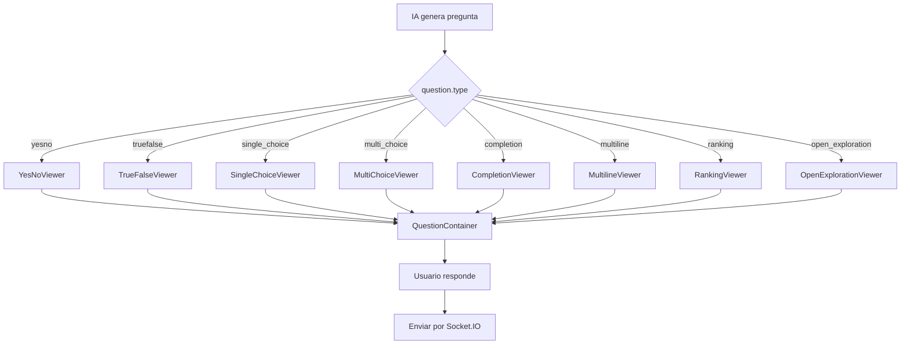

# 🎯 SISTEMA DE CAPACIDADES PARA CUESTIONARIOS

> **Descripción:** Implementación del paradigma de Arquitectura Basada en Capacidades para el sistema de cuestionarios.  
> **Ubicación:** `/apps/web/components/chat/`  
> **Última actualización:** 2026-03-19

---

## 📐 ARQUITECTURA DE CAPACIDADES

### Principio Fundamental

Cada tipo de pregunta es una **capacidad autocontenida** que:
1. ✅ Tiene su propio Viewer (UI)
2. ✅ Es independiente de las demás capacidades
3. ✅ Se monta en un container común
4. ✅ Se activa por evento (Socket.IO o acción directa)

---

## 🏗️ ESTRUCTURA DE CAPACIDADES

```
apps/web/components/chat/
├── QuestionContainer.tsx          # Container unificado (Superficie de montaje)
└── viewers/
    ├── YesNoViewer.tsx            # Capacidad: Sí/No
    ├── TrueFalseViewer.tsx        # Capacidad: Verdadero/Falso
    ├── SingleChoiceViewer.tsx     # Capacidad: Selección única
    ├── MultiChoiceViewer.tsx      # Capacidad: Selección múltiple
    ├── CompletionViewer.tsx       # Capacidad: Completación
    ├── MultilineViewer.tsx        # Capacidad: Texto multilínea
    ├── RankingViewer.tsx          # Capacidad: Ranking
    └── OpenExplorationViewer.tsx  # Capacidad: Exploración abierta
```

---

## 🔄 FLUJO DE EVENTOS

```
┌─────────────────────────────────────────────────────────────┐
│ 1. IA genera pregunta (questionnaire-engine/actions.ts)     │
│    → generateQuestion('has_prototype', context)             │
└─────────────────────────────────────────────────────────────┘
                          ↓
┌─────────────────────────────────────────────────────────────┐
│ 2. Servidor Socket.IO emite evento                          │
│    → socket.emit('question:next', question)                 │
└─────────────────────────────────────────────────────────────┘
                          ↓
┌─────────────────────────────────────────────────────────────┐
│ 3. Frontend recibe evento (SocketProvider)                  │
│    → setCurrentQuestion(question)                           │
└─────────────────────────────────────────────────────────────┘
                          ↓
┌─────────────────────────────────────────────────────────────┐
│ 4. QuestionContainer renderiza capacidad según type         │
│    → const Viewer = VIEWERS[question.type]                  │
│    → <Viewer question={...} value={...} onChange={...} />   │
└─────────────────────────────────────────────────────────────┘
                          ↓
┌─────────────────────────────────────────────────────────────┐
│ 5. Usuario interactúa con la capacidad                      │
│    → onChange(answer)                                       │
│    → handleSubmit()                                         │
└─────────────────────────────────────────────────────────────┘
                          ↓
┌─────────────────────────────────────────────────────────────┐
│ 6. Respuesta se envía por Socket.IO                         │
│    → socket.emit('option:select', questionId, answer)       │
└─────────────────────────────────────────────────────────────┘
```

---

## 📋 CAPACIDADES IMPLEMENTADAS (8/8)

| Capacidad | Viewer | Tipo | Estado |
|-----------|--------|------|--------|
| **Sí/No** | `YesNoViewer` | `yesno` | ✅ |
| **Verdadero/Falso** | `TrueFalseViewer` | `truefalse` | ✅ |
| **Selección única** | `SingleChoiceViewer` | `single_choice` | ✅ |
| **Selección múltiple** | `MultiChoiceViewer` | `multi_choice` | ✅ |
| **Completación** | `CompletionViewer` | `completion` | ✅ |
| **Texto multilínea** | `MultilineViewer` | `multiline` | ✅ |
| **Ranking** | `RankingViewer` | `ranking` | ✅ |
| **Exploración abierta** | `OpenExplorationViewer` | `open_exploration` | ✅ |

---

## 🔌 INTEGRACIÓN CON SOCKET.IO (PENDIENTE)

**Archivo a actualizar:** `apps/server/src/sockets/questionnaire-handler.ts` (crear)

```typescript
// Pseudo-código para integración
socket.on('questionnaire:start', (domain) => {
  const quiz = getQuizByDomain(domain);
  const question = getNextQuestion(quiz);
  socket.emit('question:next', question);
});

socket.on('option:select', (questionId, answer, comment) => {
  // Guardar respuesta
  // Calcular siguiente pregunta
  const nextQuestion = getNextQuestion(quiz);
  socket.emit('question:next', nextQuestion);
});
```

---

## 🎯 DIAGRAMA DE REFERENCIA

Este sistema implementa el **Diagrama 02: Inferencia de Tipo de Pregunta**:



---

## 📝 USO EN EL CÓDIGO

### En componentes React

```tsx
import { QuestionContainer } from '@/components/chat/QuestionContainer';

function ChatInterface() {
  return (
    <div>
      {/* Otros componentes */}
      <QuestionContainer />
      {/* Otros componentes */}
    </div>
  );
}
```

### En SocketProvider (pendiente)

```tsx
// apps/web/components/providers/SocketProvider.tsx
socket.on('question:next', (question) => {
  setCurrentQuestion(question);
  setMode('questionnaire');
});
```

---

## 🔗 RELACIÓN CON OTROS MÓDULOS

| Módulo | Relación |
|--------|----------|
| `questionnaire-engine` | Genera preguntas con `generateQuestion()` |
| `quiz-engine` | Provee banco de cuestionarios por dominio |
| `socket-server` | Emite/recibe eventos de preguntas |
| `chatStore` | Almacena `currentQuestion` en Zustand |

---

**Última actualización:** 2026-03-19  
**Estado:** 8/8 capacidades implementadas  
**Próximo paso:** Integrar con Socket.IO para flujo completo

---

*Fin de DOCUMENTACIÓN DE CAPACIDADES*
