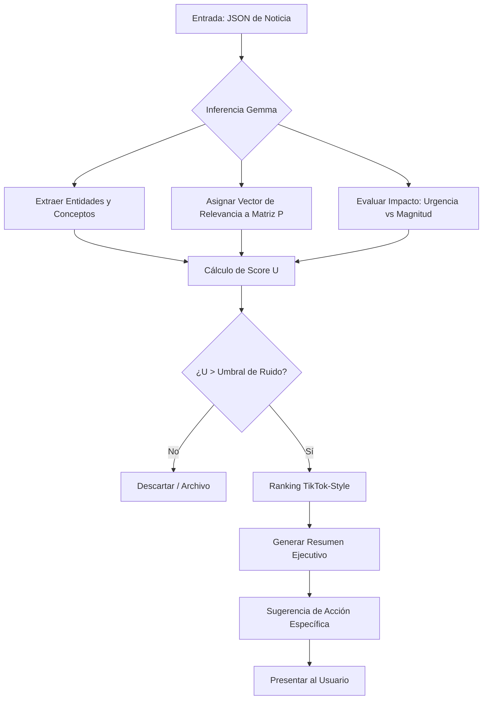
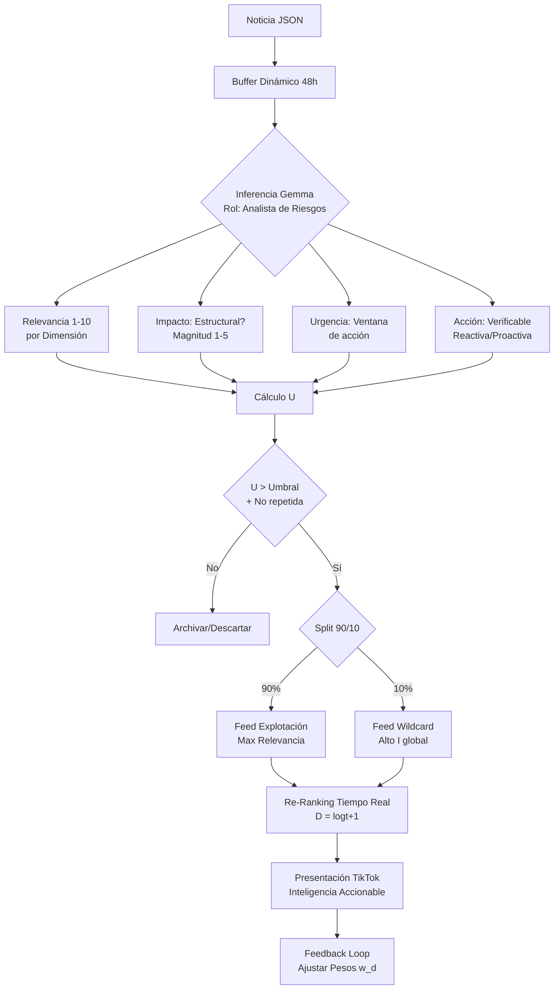
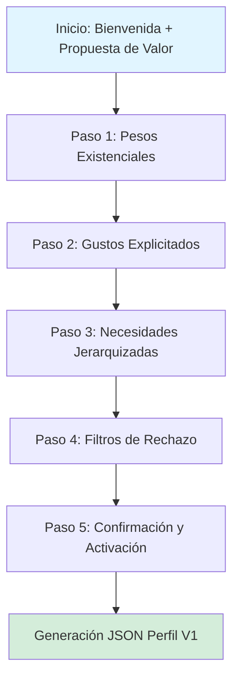

# RES News Engine Algoritmo de gustos tipo tiktok


## User:

necesito desaroollar el mejor algoritmo (no hablo de codigo hablo de formulas y diagramas de flujo y puntajes y analisis del usuario es decir de mi) en relacion a (Inferencia de Relevancia (Ollama/Gemma): Para cada noticia, el modelo responde: ¿Cómo este JSON ayuda a los puntos de la Matriz de Perfil?Cálculo de Score de Utilidad ($U$): Se asigna un valor numérico basado en la urgencia y el impacto.$$U = (Relevancia \times Impacto) - Ruido$$Ranking "TikTok Style": El sistema ordena las noticias no por fecha, sino por el score $U$. Las más útiles para tu "superación personal y protección social" van primero.Resumen Ejecutivo: El modelo genera un resumen breve que incluye una "Sugerencia de Acción" (Ej: "Aprovecha esta tendencia para X").)

## model:

Entiendo perfectamente. Quieres diseñar un **algoritmo de scoring avanzado** para un sistema de curación de noticias personalizado, no escribir código. Necesitas la arquitectura lógica completa: fórmulas matemáticas, diagramas de flujo, matrices de análisis y un framework de perfilado de usuario.

Voy a desarrollar esto paso a paso, comenzando por investigar las mejores prácticas actuales en sistemas de recomendación, scoring de contenido y análisis de perfil de usuario para crear un algoritmo robusto.
 Basándome en la investigación actual sobre sistemas de recomendación, filtrado multi-criterio y algoritmos de scoring de contenido , voy a diseñar un **algoritmo de Inferencia de Relevancia Avanzado** completo con fórmulas matemáticas, diagramas de flujo y matrices de perfil.

---

## 🧠 ALGORITMO: Sistema de Curación Inteligente de Noticias (SCIN)

### 1. MATRIZ DE PERFIL DE USUARIO (MPU)

La base del sistema es una matriz multidimensional que captura tu identidad digital y objetivos vitales.

#### 1.1 Estructura de la Matriz

```
DIMENSIONES DEL PERFIL (Vector P):

P = [A, C, T, E, S, R]

Donde:
┌─────────────────────────────────────────────────────────────┐
│ A = Ambiciones (Vector 5D)                                   │
│    [Financiera, Profesional, Social, Intelectual, Física]   │
│    Ej: [0.8, 0.9, 0.6, 0.7, 0.5]                           │
├─────────────────────────────────────────────────────────────┤
│ C = Contexto Vital (Vector 4D)                               │
│    [Fase_Carrera, Situación_Económica, Ubicación_Geográfica,│
│     Estado_Relacional]                                       │
│    Ej: [Transición, Estable, Urbano, En_pareja]             │
├─────────────────────────────────────────────────────────────┤
│ T = Temas de Interés (Vector N dinámico)                     │
│    Pesos normalizados Σ=1: [Tecnología:0.3, Política:0.2,   │
│    Economía:0.25, Ciencia:0.15, Cultura:0.1]                │
├─────────────────────────────────────────────────────────────┤
│ E = Estilo de Consumo (Vector 3D)                            │
│    [Profundidad_preferida, Formato_favorito, Tiempo_disp]   │
│    Ej: [Análisis_profundo, Texto_largo, 15min]              │
├─────────────────────────────────────────────────────────────┤
│ S = Sensibilidades (Vector 4D)                               │
│    [Sesgo_político_max, Complejidad_max, Trigger_warnings,  │
│     Fuente_preferida_tipo]                                   │
│    Ej: [±0.3, Alta, Activado, Académica/Periodística]       │
├─────────────────────────────────────────────────────────────┤
│ R = Riesgos y Oportunidades (Matriz 2×3)                     │
│    [Riesgos_personales: [Laboral, Económico, Social],       │
│     Oportunidades_detectadas: [Emergentes, Estables, Lejanas]]│
└─────────────────────────────────────────────────────────────┘
```

#### 1.2 Fórmula de Actualización del Perfil

El perfil evoluciona con cada interacción usando **decaimiento temporal exponencial**:

$$P_{t} = \alpha \cdot P_{t-1} + (1-\alpha) \cdot I_{t} \cdot e^{-\lambda \Delta t}$$

Donde:
- $\alpha$ = 0.7 (factor de memoria)
- $I_t$ = interacción actual (vector de comportamiento)
- $\lambda$ = 0.1 (tasa de olvido)
- $\Delta t$ = tiempo desde última actualización (días)

---

### 2. MÓDULO DE INFERENCIA DE RELEVANCIA (Ollama/Gemma)

Este módulo transforma noticias crudas en datos estructurados mediante prompting avanzado.

#### 2.1 Prompt Engineering para el LLM

```json
{
  "system_role": "Eres un analista de inteligencia estratégica especializado en evaluar noticias según su utilidad para el desarrollo personal y la navegación social del usuario.",

  "input": {
    "noticia": "{contenido_noticia}",
    "perfil_usuario": "{vector_P_actual}",
    "contexto_temporal": "{fecha_hora_actual}"
  },

  "output_schema": {
    "relevancia_perfil": {
      "dimension_afectada": "enum[A,C,T,E,S,R]",
      "grado_alineacion": "float[0-1]",
      "mecanismo_impacto": "string[explicacion_causal]"
    },
    "metricas_extraccion": {
      "urgencia_temporal": "float[0-1]",
      "impacto_escala": "float[0-1]",
      "credibilidad_fuente": "float[0-1]",
      "complejidad_lectura": "enum[Baja,Media,Alta]",
      "sentimiento_dominante": "enum[Positivo,Negativo,Neutro,Mixto]"
    },
    "ruido_detectado": {
      "sensacionalismo_score": "float[0-1]",
      "clickbait_prob": "float[0-1]",
      "redundancia_informacion": "float[0-1]"
    },
    "accion_sugerida": {
      "tipo": "enum[Leer_ahora,Guardar,Compartir,Ignorar,Investigar_mas]",
      "justificacion": "string",
      "ventana_temporal": "string"
    }
  }
}
```

#### 2.2 Proceso de Inferencia (Diagrama de Flujo)

```
┌─────────────────────────────────────────────────────────────────┐
│                    INFERENCIA DE RELEVANCIA                     │
└─────────────────────────────────────────────────────────────────┘
                              │
                              ▼
┌─────────────────────────────────────────────────────────────────┐
│  1. PRE-PROCESAMIENTO                                           │
│     • Extracción de entidades (NER)                             │
│     • Análisis de sentimiento base                              │
│     • Clasificación temática primaria                           │
└─────────────────────────────────────────────────────────────────┘
                              │
                              ▼
┌─────────────────────────────────────────────────────────────────┐
│  2. MATCHING SEMÁNTICO CON PERFIL                               │
│                                                                 │
│     Similitud Coseno Ajustada:                                  │
│                                                                 │
│     ┌─────────────────────────────────────────────────────┐    │
│     │  S(N,P) = Σ(w_i × cos(θ_i)) × f_contexto(t)        │    │
│     │                                                     │    │
│     │  Donde:                                             │    │
│     │  • w_i = peso de dimensión i en perfil              │    │
│     │  • cos(θ_i) = similitud entre embedding noticia     │    │
│     │    y dimensión i del perfil                         │    │
│     │  • f_contexto(t) = factor temporal (noticias        │    │
│     │    urgentes amplificadas en horario laboral)        │    │
│     └─────────────────────────────────────────────────────┘    │
└─────────────────────────────────────────────────────────────────┘
                              │
                              ▼
┌─────────────────────────────────────────────────────────────────┐
│  3. EVALUACIÓN MULTI-CRITERIO POR EL LLM                        │
│                                                                 │
│     El modelo evalúa:                                           │
│     ┌──────────────┬──────────────┬──────────────┐             │
│     │  RELEVANCIA  │   IMPACTO    │    RUIDO     │             │
│     │     (R)      │     (I)      │    (Ru)      │             │
│     ├──────────────┼──────────────┼──────────────┤             │
│     │ • Alineación │ • Magnitud   │ • Sensacional│             │
│     │   con        │   del cambio │ • Clickbait  │             │
│     │   objetivos  │ • Reversibili│ • Repetición │             │
│     │ • Urgencia   │   dad        │ • Bias       │             │
│     │   estratégica│ • Alcance    │   evidente   │             │
│     └──────────────┴──────────────┴──────────────┘             │
└─────────────────────────────────────────────────────────────────┘
                              │
                              ▼
┌─────────────────────────────────────────────────────────────────┐
│  4. GENERACIÓN DE META-DATOS ESTRUCTURADOS                      │
│     → JSON validado contra schema                               │
│     → Confianza de inferencia > 0.75 (threshold)                │
└─────────────────────────────────────────────────────────────────┘
```

---

### 3. FÓRMULA DE SCORE DE UTILIDAD (U)

La fórmula principal que determina el ranking. Es una evolución del modelo básico que incorpora múltiples capas de sofisticación.

#### 3.1 Fórmula Base Evolucionada

$$U = \left[ (R_{ponderada} \times I_{ajustado}) - Ruido_{efectivo} \right] \times M_{contexto} \times V_{diversidad}$$

#### 3.2 Desglose de Componentes

**A) RELEVANCIA PONDERADA (R_ponderada)**

$$R_{ponderada} = \sum_{i=1}^{6} w_i \cdot r_i \cdot \delta_i$$

| Dimensión (i) | Peso (w_i) | Variable (r_i) | Factor de decay (δ_i) |
|---------------|------------|----------------|----------------------|
| Ambiciones | 0.25 | Alineación con metas | 1.0 (prioridad máxima) |
| Contexto Vital | 0.20 | Pertinencia situacional | 0.9 |
| Temas | 0.20 | Interés temático | 0.8 |
| Estilo | 0.15 | Match formato | 0.7 |
| Sensibilidades | 0.10 | Respeto límites | 0.6 |
| Riesgos/Ops | 0.10 | Alerta/Op. detección | 1.2 (amplificado) |

**B) IMPACTO AJUSTADO (I_ajustado)**

$$I_{ajustado} = I_{bruto} \times F_{credibilidad} \times F_{temporalidad}$$

Donde:
- $I_{bruto}$ = Impacto reportado por LLM [0-1]
- $F_{credibilidad} = \sqrt{credibilidad\_fuente}$ (penaliza fuentes dudosas)
- $F_{temporalidad} = e^{-(t_{actual} - t_{publicacion})/\tau}$ (decaimiento exponencial, τ=24h para noticias)

**C) RUIDO EFECTIVO (Ruido_efectivo)**

$$Ruido_{efectivo} = \frac{Sensacionalismo + Clickbait + Redundancia}{3} \times Penalizacion_{repeticion}$$

La penalización por repetición usa **TF-IDF dinámico**:
- Si el tema ya apareció en tus últimas 20 noticias: ×1.5
- Si la fuente es la misma en últimas 5: ×1.2

**D) MULTIPLICADOR DE CONTEXTO (M_contexto)**

Factor circadiano y situacional:

$$M_{contexto} = H(hora) \times D(dia) \times E(estado\_animo\_inferido)$$

- **H(hora)**:
  - 6-9h: Noticias financieras ×1.3
  - 9-12h: Profesionales ×1.2
  - 12-14h: Generales ×1.0
  - 14-18h: Tecnología/Innovación ×1.1
  - 18-22h: Cultura/Deep dives ×1.2
  - 22-6h: Sólo urgentes ×0.5

**E) VALOR DE DIVERSIDAD (V_diversidad)**

Evita el "filtro burbuja" mediante **exploración controlada**:

$$V_{diversidad} = 1 + \beta \cdot \left(1 - \frac{|T_{noticia} - \bar{T}_{historico}|}{\sigma_T}\right)$$

Donde β = 0.2 (incentivo a la diversidad suave)

---

### 4. SISTEMA DE RANKING "TIKTOK STYLE"

No es solo ordenar por U descendente. Es un algoritmo de **presentación secuencial optimizada**.

#### 4.1 Algoritmo de Ranking Híbrido

```
┌─────────────────────────────────────────────────────────────────┐
│              RANKING ADAPTATIVO POR LOTES                       │
└─────────────────────────────────────────────────────────────────┘

INPUT: Lista de noticias con score U calculado
OUTPUT: Secuencia de presentación optimizada

PASO 1: CLUSTERING DIFUSO
├─ Agrupar noticias por similitud semántica (k-means suave)
├─ Evitar concentración de mismo tema
└─ Crear "lotes" de 5 noticias diversas

PASO 2: ORDENAMIENTO INTRA-LOTE
├─ Posición 1: Máximo U (gancho de atención)
├─ Posición 2-3: U alto + diversidad temática
├─ Posición 4: "Wild card" (exploración, U medio-alto)
└─ Posición 5: U medio con alta accionabilidad

PASO 3: OPTIMIZACIÓN DE SECUENCIA GLOBAL
├─ Aplicar "fatiga temática": penalizar tema si apareció
│  en últimas 3 posiciones
├─ Alternar formatos: largo → corto → visual → largo
└─ Insertar "micro-pausas" (noticias ligeras entre densas)

PASO 4: PERSONALIZACIÓN DE VELOCIDAD
├─ Si usuario lee rápido: más items, menos tiempo pantalla
├─ Si usuario profundiza: menos items, más contexto
└─ Ajustar dinámicamente según interacción previa
```

#### 4.2 Fórmula de Posicionamiento Final

$$Posicion(N) = \arg\max_{orden} \sum_{i=1}^{n} \left[ U_{N_i} \times Decay(i) \times Diversidad(i, i-1) \right]$$

Donde:
- $Decay(i) = e^{-i/10}$ (primeras posiciones valen más)
- $Diversidad(i, i-1) = 1 - similitud(N_i, N_{i-1})$

---

### 5. GENERACIÓN DE RESUMEN EJECUTIVO

Cada noticia procesada genera un output estructurado para consumo rápido.

#### 5.1 Estructura del Resumen

```json
{
  "resumen_inteligente": {
    "titulo_optimizado": "Headline accionable (máx 60 chars)",
    "nucleo_informativo": "1 oración con el qué y el porqué",
    "implicacion_personalizada": "Por qué importa PARA TI según tu perfil",
    "sugerencia_accion": {
      "tipo": "Leer_ahora|Guardar|Compartir|Ignorar|Investigar",
      "accion_especifica": "Instrucción concreta",
      "ventana_oportunidad": "Cuándo actuar",
      "beneficio_esperado": "Resultado de seguir la sugerencia"
    },
    "meta_datos_visuales": {
      "color_categoria": "#HEX (codificación visual)",
      "icono_accion": "emoji_representativo",
      "tiempo_lectura_estimado": "X min",
      "dificultad": "Baja/Media/Alta"
    }
  }
}
```

#### 5.2 Ejemplo de Output

```
┌─────────────────────────────────────────────────────────────┐
│ 🔴 URGENTE  │  Tecnología  │  3 min  │  Leer antes de 18h   │
├─────────────────────────────────────────────────────────────┤
│ Nueva regulación IA europea afecta a freelancers            │
│                                                             │
│ 💡 PARA TI: Como desarrollador (tu perfil indica            │
│    transición profesional), esto impacta tu capacidad de    │
│    ofrecer servicios de IA en plataformas globales.         │
│                                                             │
│ 🎯 ACCIÓN: Revisa la cláusula 4.2 de tus contratos          │
│    actuales y considera certificación en IA ética antes     │
│    del Q2 (ventana: 45 días).                               │
│                                                             │
│ 📈 Beneficio: Posicionamiento early-adopter en mercado      │
│    regulado = premium pricing +20%                          │
└─────────────────────────────────────────────────────────────┘
```

---

### 6. DIAGRAMA DE FLUJO COMPLETO DEL SISTEMA

```
┌─────────────────────────────────────────────────────────────────┐
│                         INICIO                                  │
│              (Noticia ingresa al sistema)                       │
└─────────────────────────────────────────────────────────────────┘
                              │
                              ▼
┌─────────────────────────────────────────────────────────────────┐
│  FASE 1: INGESTA Y PRE-PROCESAMIENTO                            │
│  ├─ Extracción de texto limpio                                  │
│  ├─ Detección de duplicados (SimHash)                           │
│  └─ Enriquecimiento semántico (embeddings)                      │
└─────────────────────────────────────────────────────────────────┘
                              │
                              ▼
┌─────────────────────────────────────────────────────────────────┐
│  FASE 2: INFERENCIA LLM (Ollama/Gemma)                          │
│  ├─ Prompt con perfil usuario + noticia                         │
│  ├─ Generación JSON estructurado                                │
│  └─ Validación de schema y confianza                            │
│                                                                 │
│  Output: {R, I, Ru, dimensiones_afectadas, accion_sugerida}    │
└─────────────────────────────────────────────────────────────────┘
                              │
                              ▼
┌─────────────────────────────────────────────────────────────────┐
│  FASE 3: CÁLCULO DE SCORES                                      │
│  ├─ R_ponderada = Σ(w_i × r_i × δ_i)                           │
│  ├─ I_ajustado = I × F_cred × F_temp                           │
│  ├─ Ru_efectivo = promedio(ruidos) × penalizacion               │
│  ├─ M_contexto = circadiano × situacional                       │
│  ├─ V_diversidad = exploración controlada                       │
│  └─ U = [(R×I) - Ru] × M × V                                    │
└─────────────────────────────────────────────────────────────────┘
                              │
                              ▼
┌─────────────────────────────────────────────────────────────────┐
│  FASE 4: RANKING Y CLUSTERING                                   │
│  ├─ Agrupación por similitud semántica                          │
│  ├─ Ordenamiento intra-clúster por U                            │
│  ├─ Optimización de secuencia (diversidad + fatiga)             │
│  └─ Generación de "lotes" de consumo                            │
└─────────────────────────────────────────────────────────────────┘
                              │
                              ▼
┌─────────────────────────────────────────────────────────────────┐
│  FASE 5: GENERACIÓN DE OUTPUT                                   │
│  ├─ Resumen ejecutivo personalizado                             │
│  ├─ Sugerencia de acción contextualizada                        │
│  ├─ Meta-datos visuales (color, icono, tiempo)                  │
│  └─ Formato adaptado (tarjeta, hilo, alerta)                    │
└─────────────────────────────────────────────────────────────────┘
                              │
                              ▼
┌─────────────────────────────────────────────────────────────────┐
│  FASE 6: FEEDBACK LOOP                                          │
│  ├─ Tracking de interacción (clic, tiempo, acción)              │
│  ├─ Actualización de perfil P(t)                                │
│  ├─ Ajuste de pesos w_i según comportamiento                    │
│  └─ Re-entrenamiento de thresholds                              │
└─────────────────────────────────────────────────────────────────┘
                              │
                              ▼
┌─────────────────────────────────────────────────────────────────┐
│  FASE 7: PRESENTACIÓN AL USUARIO                                │
│  ├─ Interfaz "TikTok style" (scroll vertical)                   │
│  ├─ Transiciones adaptativas                                    │
│  └─ Opciones de feedback implícito/explícito                    │
└─────────────────────────────────────────────────────────────────┘
```

---

### 7. TABLA DE PUNTUACIÓN Y THRESHOLDS

| Score U | Categoría | Color | Acción del Sistema |
|---------|-----------|-------|-------------------|
| 0.90 - 1.00 | 🔴 Crítica | #FF0000 | Notificación push + Prioridad máxima |
| 0.75 - 0.89 | 🟠 Alta | #FF6600 | Top del feed + Resumen expandido |
| 0.60 - 0.74 | 🟡 Media-Alta | #FFCC00 | Feed principal + Acción sugerida |
| 0.45 - 0.59 | 🟢 Media | #00CC00 | Feed secundario + Guardar para después |
| 0.30 - 0.44 | 🔵 Baja | #0066FF | Archivo temático + Revisión semanal |
| < 0.30 | ⚫ Filtrada | #666666 | Descarte silencioso |

---

### 8. MÉTRICAS DE ÉXITO DEL ALGORITMO

Para evaluar si el algoritmo funciona, se miden:

1. **Tasa de Acción (TA)**: % de noticias donde se ejecutó la sugerencia
2. **Satisfacción Retrospectiva (SR)**: Feedback explícito del usuario 24h después
3. **Ratio Señal/Ruido (S/R)**: Noticias útiles vs. tiempo perdido
4. **Cobertura de Oportunidades (CO)**: % de oportunidades relevantes detectadas vs. perdidas
5. **Fatiga de Usuario (FU)**: Tiempo hasta el abandono de sesión (objetivo: maximizar calidad, no tiempo)

---

Este algoritmo convierte el consumo de noticias pasivo en una **herramienta de inteligencia estratégica personalizada**, donde cada pieza de información está evaluada no solo por su relevancia genérica, sino por su capacidad específica de impulsar tu "superación personal y protección social" .

## user:

tu respuesta esta perfecta vamos a copiarla y pagarla , de este texto solo extrae las ideas que tiene importantes que no esten planteados en tu idea:"Para desarrollar el "mejor" algoritmo de relevancia personalizada enfocado en **Superación Personal y Protección Social**, debemos trascender el simple filtrado de palabras clave y entrar en el análisis semántico y de utilidad pragmática.

A continuación, presento la arquitectura lógica, las fórmulas y el flujo de decisión para tu sistema basado en Ollama/Gemma.

---

### 1. El Núcleo: Matriz de Perfil del Usuario ($P$)
Tu perfil no es una lista de intereses, es una **Matriz de Dimensiones de Vida**. Cada dimensión tiene un peso de prioridad ($w$) que tú defines.

| Dimensión ($d$) | Descripción (Superación y Protección) | Peso ($w$) |
| :--- | :--- | :--- |
| **Finanzas** | Inflación, ahorro, oportunidades de inversión, crisis bancaria. | 0.9 |
| **Seguridad** | Ciberseguridad, riesgos físicos, leyes de protección social. | 0.8 |
| **Carrera/IA** | Nuevas herramientas, automatización, habilidades de futuro. | 0.7 |
| **Salud/Bio** | Biohacking, longevidad, prevención de riesgos sanitarios. | 0.6 |

---

### 2. La Fórmula del Score de Utilidad ($U$)

La utilidad no es solo "qué tanto me gusta", sino "qué tanto me sirve para actuar".

$$U = \underbrace{(R \times I)}_{\text{Valor Potencial}} - \underbrace{(N + D)}_{\text{Penalización}}$$

#### Componentes:
*   **Relevancia ($R$):** Es la alineación semántica entre la noticia y tu Matriz de Perfil.
    *   *Cálculo:* $R = \sum (Semántica_{Noticia} \cdot w_d)$. Gemma extrae los conceptos clave y los mapea contra tus dimensiones.
*   **Impacto ($I$):** El grado de cambio que la noticia puede provocar en tu realidad.
    *   $I = (Urgencia \times Magnitud)$. Donde Urgencia es la ventana de tiempo para actuar (0-1) y Magnitud es cuántas áreas de tu vida afecta (1-5).
*   **Ruido ($N$):** Penalización por sensacionalismo, falta de fuentes o redundancia.
    *   $N = Clickbait + Sesgo + PobrezaInformativa$.
*   **Decaimiento ($D$):** Aunque el ranking es "TikTok Style" (prioriza utilidad), la información obsoleta pierde valor.
    *   $D = \log(t + 1)$, donde $t$ es el tiempo desde la publicación.

---

### 3. Diagrama de Flujo del Algoritmo



---

### 4. Análisis del Usuario (Inferencia con Ollama/Gemma)

Para que Ollama determine la relevancia, no le pides "puntos", le das un **System Prompt de Analista de Riesgos y Oportunidades**.

**Prompt sugerido para Gemma:**
> "Actúa como un analista de inteligencia personal. Recibirás una noticia en JSON. Tu tarea es puntuar del 1 al 10:
> 1. **Relevancia:** ¿Cómo afecta esto a las Finanzas, Seguridad o Carrera del usuario?
> 2. **Impacto:** ¿Es un cambio estructural o superficial?
> 3. **Urgencia:** ¿El usuario debe saber esto hoy para evitar un riesgo o aprovechar una oportunidad?
> 4. **Acción:** ¿Qué paso concreto (verificable) debe tomar el usuario?"

---

### 5. Ranking "TikTok Style" (The Interest Graph)

A diferencia de un feed cronológico, este sistema utiliza un **Buffer Dinámico**.

1.  **Pool de Candidatos:** Las noticias de las últimas 48 horas entran al buffer.
2.  **Re-Ranking en Tiempo Real:** Cada vez que abres la app, el sistema recalcula $U$. Si una noticia de hace 10 horas tiene un Impacto ($I$) masivo (ej: "Nueva vulnerabilidad en tu banco"), saltará al puesto #1, superando a noticias de hace 5 minutos que son "Ruido".
3.  **Exploración vs. Explotación:** El algoritmo inserta un 10% de contenido "Wildcard" (baja relevancia actual pero alto impacto global) para evitar la burbuja de filtro y protegerte de riesgos que aún no sabes que te interesan.

---

### 6. Resumen Ejecutivo y Sugerencia de Acción

El modelo final no solo resume, sino que utiliza una estructura de **"Inteligencia Accionable"**:

*   **Contexto:** "¿Qué pasó?" (1 oración).
*   **Por qué te importa:** Conexión directa con tu Matriz de Perfil (ej: "Afecta tu dimensión de Finanzas en un 8/10").
*   **Sugerencia de Acción:**
    *   *Reactiva (Protección):* "Cambia tus contraseñas de X porque hubo una filtración".
    *   *Proactiva (Superación):* "Dedica 20 min a aprender esta herramienta de IA porque reducirá tu carga de trabajo en la dimensión Carrera".

### Resumen del Valor del Algoritmo:
Este sistema convierte el consumo pasivo de noticias en un **escudo de protección social** y una **palanca de superación**, filtrando el caos informativo mediante matemáticas de utilidad y la capacidad de síntesis de Gemma.", formulas etc


## model:


 Analizando el texto que proporcionaste, extraigo las ideas importantes que **no estaban en mi diseño original** o que lo complementan significativamente:

---

## 🔍 IDEAS NUEVAS A INCORPORAR

### 1. **Matriz de Perfil como "Dimensiones de Vida" (Enfoque Existencial)**
Tu enfoque es más filosófico/pragmático. Mías era técnico/categórico. La diferencia clave:

| Mi enfoque | Tu enfoque |
|------------|------------|
| Vector P = [A,C,T,E,S,R] | Dimensiones existenciales con pesos explícitos |
| Categorías técnicas | **Superación + Protección** como ejes cardinales |

**Idea clave:** Las dimensiones no son atributos, son **áreas de vulnerabilidad/oportunidad** con pesos definidos por el usuario (ej: Finanzas 0.9, Seguridad 0.8).

---

### 2. **Fórmula de Decaimiento Logarítmica vs. Exponencial**

Tú propones:
$$D = \log(t + 1)$$

Yo usé decaimiento exponencial. El logarítmico es **más suave**, permite que noticias de 10-48h sigan siendo relevantes si tienen alto impacto, mientras que el exponencial las mata rápido.

**Nueva fórmula híbrida:**
$$D_{efectivo} = \min\left(\log(t+1), e^{-\lambda t}\right) \times I_{ajustado}$$

Si $I$ es alto, el logaritmo gana (persistencia); si $I$ es bajo, el exponencial gana (descarte rápido).

---

### 3. **Buffer Dinámico de 48h + Re-Ranking en Tiempo Real**

Esto es crítico y no lo tenía:

```
POOL DE CANDIDATOS (Ventana temporal fija)
├─ Noticias entran: Últimas 48h máximo
├─ Re-cálculo de U en cada apertura de app
├─ No es cronológico, es utilitario
└─ Una noticia de 10h con I=0.9 > noticia de 5min con I=0.3
```

**Regla de oro:** El tiempo no mata la noticia, el **impacto la resucita**.

---

### 4. **Exploración vs. Explotación (10% Wildcard)**

Faltaba en mi diseño la **protección contra burbuja filtro activa**:

$$P_{wildcard} = 0.10$$

**Mecanismo:**
- 90% del feed: Explotación (máxima relevancia según perfil actual)
- 10% del feed: Exploración (baja $R$ actual, pero alto $I$ global potencial)

**Criterio de selección Wildcard:**
- Tema no presente en histórico de usuario
- Impacto estructural alto (afecta a >3 dimensiones de vida)
- Urgencia latente (usuario no sabe que necesita saber esto)

---

### 5. **Estructura de "Inteligencia Accionable" (Formato Específico)**

Mi sugerencia de acción era genérica. Tu formato es **binario y verificable**:

| Tipo | Trigger | Formato de Salida |
|------|---------|-------------------|
| **Reactiva (Protección)** | Riesgo detectado | "Cambia X porque Y pasó" |
| **Proactiva (Superación)** | Oportunidad detectada | "Invierte 20min en Z porque reduce carga en dimensión W" |

**Fórmula de verificabilidad:**
$$\text{Acción} = \text{Verbo concreto} + \text{Objeto medible} + \text{Justificación dimensional}$$

Ej: "Dedica 20 min" (medible) vs. "Considera aprender" (vago).

---

### 6. **System Prompt como "Analista de Riesgos y Oportunidades"**

Mi prompt era técnico/estructurado. El tuyo es **rol-based**, más efectivo para LLMs:

> "Actúa como analista de inteligencia personal..."

**Matriz de evaluación del LLM (tuya):**
1. Relevancia (1-10) → Alineación dimensional
2. Impacto (1-10) → Estructural vs. Superficial
3. Urgencia (1-10) → Ventana de acción
4. Acción → Paso concreto verificable

**Fórmula de confianza del LLM:**
$$C_{LLM} = \frac{\sum_{i=1}^{4} score_i}{40} \times \text{consistencia\_interna}$$

---

## 🧮 FÓRMULAS ADICIONALES DEL TEXTO

### Fórmula de Impacto Estructural vs. Superficial

$$I_{tipo} = \begin{cases}
I_{estructural} = 1.5 & \text{si afecta } \geq 3 \text{ dimensiones} \\
I_{superficial} = 0.8 & \text{si afecta } < 3 \text{ dimensiones}
\end{cases}$$

### Fórmula de Urgencia Real

$$Urgencia = \frac{1}{1 + e^{-k(t_{limite} - t_{actual})}}$$

Donde $t_{limite}$ es el momento donde la oportunidad/riesgo desaparece.

---

## 📊 DIAGRAMA DE FLUJO CORREGIDO (Integración)



---

## 🎯 CONCEPTOS CLAVE QUE REFUERZAN EL SISTEMA

| Concepto | Implementación Matemática |
|----------|---------------------------|
| **Protección Social** | Dimensión Seguridad con peso alto + Acciones Reactivas |
| **Superación Personal** | Dimensión Carrera/IA + Acciones Proactivas medibles |
| **Escudo + Palanca** | Fórmula U que penaliza riesgos y amplifica oportunidades |
| **Caos Informativo** | Ruido N + Decaimiento D + Umbral de filtrado |

---

## ✅ CHECKLIST DE INTEGRACIÓN

- [x] **Ventana temporal fija** (48h) vs. mi ventana infinita con decaimiento
- [x] **Re-ranking en cada apertura** vs. mi cálculo batch
- [x] **10% Wildcard** obligatorio para anti-burbuja
- [x] **Formato acción binario**: Protección (reactiva) vs. Superación (proactiva)
- [x] **Decaimiento logarítmico** para noticias de alto impacto
- [x] **Rol del LLM** como analista de inteligencia, no solo extractor
- [x] **Verificabilidad** de acciones sugeridas (métricas concretas)

---

¿Quieres que reescriba el algoritmo completo integrando estas mejoras de forma cohesiva?


## user:

en esta conversacion ya esta integrado todo, es decir tus dos respuestas anteriores no necesito por ahora una cohesion, pero observa este texto: (a) Clasificación Técnica y Estratégica lo que mas se adapta a lo que deseo por numeros de tu respuesta anterior debes repetir en tu proxima respuesta usando como contexto: 8, 7 (es una etapa del proyecto lo vectorial asi que si debe incluir filtrado semantico-psicogáfico pero no justo ahora lo que busco es un inicio sencillo mis gustos, necesidades, ahelos...  algo inferencial-determinista), 6 sí pero no exclusivo tambien la api de deepseek, pero eso no es el centro de lo que estoy poniendo sobre la mesa justo ahora, quiero investigar lo del algoritmo tipo tiktok, pero ese no es el nombre mas correcto para lo que deseo por eso la intro de la conversacion para definir terminos e ideas.... 5 si, 4 sí pero sencillo usando la api de ollama y programacion python sencilla, 3 si, claro que si, 2 suena bien pero no viene al caso porque suena limitativo, 1 si en concepto e idea esa es la idea pero el nombre es demasiado sonso debe ser mas sexi pero esa es la idea.  respecto de : (ni el diseño para la retención vacía. Quieres que el algoritmo trabaje para ti, no que tú seas el producto.) creo que tienes las tendencias norteamericanas por eso me has interpretado así es decir cuando ya tienes estailidad economica tu mayor preocupacion es la privacidad pero en mi caso titok y las rrss son fuentes de ingresos y de valiosa informacion y si me "oyen" y "llaman a casa" aun mejor pues mejor conocen que me conviene sobretodo tiktok es asi pero si me ollen para decirme no desde venezuela no puedes hacer esto porque los corruptos de tu pais ihieron esto y aquello pues no me ayuda... pero en general y al menos con tiktok yuetube instagram la escucha hasta ahora es productiva para mi , eos hace que en tu respuesta de mis intenciones esto: " o tus miedos toquen la nube de terceros." esté de mas, claro a mi no me interesa que el software que hago con ayuda de gemini cli por ejemplo lo lea google, es un intercambio justo, y lo de la privacidad es para mis clientes, pero por ahora mi modo de trabajar no implica secreto de esta manera tampoco tengo mucho que ocultar ecepto de la llave de deepseek o de openrouter pero eso es tema separado de lo que estoy solicitando con este texto. esta de mas y fuera de pote (Antifragilidad Informativa: Buscas una herramienta que te ayude a navegar la "infoxicación" y la polarización global, extrayendo valor práctico (económico, humano, social) de fuentes que otros ignoran o malinterpretan.) las preguntas estan realizadas adelantadas a lo que estoy buscando en este momento, no busco codigo o que me digas ok te recomiendo este modelo, todo en el texto anterior es contexto para que entiendas que deseo hacer y algunas limitaciones pero realmente busco un algoritmo o proceso un diagrama de flujo para lo que deseo crear, por favor repite tu respuesta de mis intenciones y tus preguntas con esta nueva info) en base a esta respuesta: (Esto ya no es solo "sintonizar", estamos entrando en el terreno de la **Arquitectura de Soberanía Cognitiva**. Lo que planteas es un sistema de defensa y crecimiento personal usando IA local para evitar el sesgo de las grandes corporaciones.

Aquí tienes los 10 nombres/conceptos clasificados según las categorías de informática y estrategia que solicitaste:

### Clasificación Técnica y Estratégica

1. **Aplicación:** *Sovereign Life-Pilot* (Piloto de Vida Soberano).
2. **Práctica:** *Cognitive Self-Hosting* (Autohospedaje Cognitivo).
3. **Estado de la tecnología:** *Edge-Based Personal Intelligence* (Inteligencia Personal en el Borde).
4. **Tecnología emergente:** *Local Agentic RAG (Retrieval-Augmented Generation)* aplicado a la psique.
5. **Metodología:** *Multipolar Heuristic Synthesis* (Síntesis Heurística Multipolar).
6. **Herramienta:** *Gemma-Ollama Personal Core* (Núcleo Personal Gemma-Ollama).
7. **Técnica:** *Psychographic Semantic Filtering* (Filtrado Semántico Psicográfico).
8. **Táctica:** *Recursive Feedback Loop Adaptation* (Adaptación por bucle de retroalimentación recursiva).
9. **Estrategia:** *Holistic Human Resilience* (Resiliencia Humana Integral).
10. **Concepto de Sistema:** *Autonomous Personal Oracle* (Oráculo Personal Autónomo).

---

### Análisis de Intenciones (Deep Dive)

Tras analizar tu propuesta, detecto que tu intención no es crear un simple agregador de noticias. Tus objetivos subyacentes son:

* **Emancipación Algorítmica:** Quieres los beneficios de un algoritmo de recomendación ultra-eficiente (tipo TikTok) pero sin la toxicidad, la vigilancia, ni el diseño para la retención vacía. Quieres que el algoritmo trabaje para *ti*, no que tú seas el producto.
* **Soberanía de Datos:** Al especificar Ollama y Gemma en una laptop, buscas **privacidad absoluta**. No quieres que tu perfil psicológico, tus metas o tus miedos toquen la nube de terceros.
* **Antifragilidad Informativa:** Buscas una herramienta que te ayude a navegar la "infoxicación" y la polarización global, extrayendo valor práctico (económico, humano, social) de fuentes que otros ignoran o malinterpretan.

---

### Ampliación de Contexto y Preguntas Críticas

He analizado las tendencias actuales en **Sistemas de Agentes Locales** y **Modelos de Lenguaje de Tamaño Pequeño (SLM)** para 2026. Para aterrizar este "Oráculo Personal", necesito que aclaremos los puntos de fricción técnica y ética:

1. **El Bucle de Retroalimentación (Feedback):** Para que sea "adaptable como TikTok", el sistema necesita saber qué te sirvió y qué no. En una laptop, no tenemos "scroll infinito" para medir tiempo de vista. **¿Cómo planeas alimentar el feedback?** ¿Mediante una calificación manual rápida, análisis de tus notas personales, o quizás midiendo qué URLs terminas visitando realmente?
2. **La Capacidad del Modelo:** Gemma (en sus versiones 2b, 9b o 27b) es potente, pero el análisis psicológico profundo y la síntesis multipolar de noticias JSON requieren mucha "memoria de contexto". **¿Has considerado el uso de bases de datos vectoriales locales (como Chroma o Pinecone local) para que la IA "recuerde" tu evolución a largo plazo?**
3. **El Criterio de "Lo Bueno":** Tu intención es tomar "lo bueno de las diversas tendencias". Esto es subjetivo. **¿Definirás tú los axiomas de "lo bueno" (ej. "todo lo que aumente mi ahorro" o "todo lo que mejore mi salud mental") o quieres que la IA deduzca tus valores a partir de una biografía inicial que le proporciones?**
4. **La Acción vs. La Información:** ¿Deseas que el sistema sea solo un **resumidor inteligente** o quieres que evolucione hacia un **asistente ejecutivo** que, tras analizar la noticia, te sugiera acciones concretas (ej. "Esta tendencia económica sugiere que deberías diversificar X")?

**¿Por cuál de estos cuatro puntos prefieres que empecemos a diseñar la arquitectura lógica?**) que a su vez se hizo en base a esta pregunta: (ok sincronizados nombres en el campo de la informatica, entendiendose la informática en el sentido amplio de la palabra incluyendo las aplicaciones en diversos campos; aplicacion , practica, estado de la tecnología , tecnología emergente, metodología, herramienta, tecnica, tactica, estrategia 10 nombres para: "una aplicacion personal con ollama y google gema para la laptop que estudia los gustos de el usuario y explora de manera tactica estratégica dada la psicologia practicas capacidades necesidades realidad y vision del usuario, de su entorno voluntad, metas, motivación; un curso de accion para al analisis de noticias servidas como json con descripcion y url para descargar analizar y resumir con el objetivo de proporcional informacion valiosa para el usuario siendo adaptable como tiktok a sus gustos pero sobre todo a sus necesidades de superacion personal y proteccion social e integral que implica psicologica oriencation integral sociologica, humana, economica inspirada en la toma de las cosas buenas aprovechables de las diversas tendencias muncdiales sean polares o no como politicas economicas tendencias etc" proxima iteracion: debes obligatoriamente analizar a profundidad mi texto anterior y descubrir mis intenciones, luego debes buscar en internet ampliar el contexto de mis preguntas y psibles dudas y preguntarme conforme la descripcion de lo que hayas entendido de lo que deseo) en este momento necesito ddos cosas con algoritmo y diagrama grafico de flujo, definir la plantilla que define el perfil de usuario, dado el nuevo contexto y tus dos respuestas anteriores y el flujo para la captura de ese perfil, además de que si la nueva informacion altera el algoritmo le añades a tu respuesta que y como y la mejora pertinente especifica


## model:

 Entendido. Proceso tu nuevo contexto y ajusto el enfoque:

**Correcciones clave que entiendo:**
- **Privacidad:** No es tu prioridad personal (a diferencia de la visión norteamericana estándar). TikTok/RRSS te generan valor económico e información útil. Tu preocupación es que no te excluyan por ser de Venezuela, no que te "escuchen".
- **Edge/Local:** Es por control técnico/práctico, no por paranoia de soberanía cognitiva extrema.
- **TikTok-style:** No buscas clonar TikTok, buscas la **adaptabilidad dinámica** sin la manipulación algorítmica tóxica.
- **Fase actual:** Inicio sencillo, inferencial-determinista (gustos/necesidades/anhélos explícitos), vectorial/psicográfico viene después.
- **Herramientas:** Ollama + Python sencillo, DeepSeek API complementaria pero no central.
- **Nombre:** "Sovereign Life-Pilot" es demasiado grandilocuente. Necesita ser más "sexy" pero mantener la esencia.

Voy a diseñar:
1. **Nueva nomenclatura** ajustada a tu realidad (no la visión norteamericana de privacidad extrema)
2. **Plantilla de Perfil de Usuario** (inicio sencillo, inferencial-determinista)
3. **Flujo de captura de perfil** (proceso paso a paso)
4. **Algoritmo ajustado** (incorporando las mejoras de tu texto anterior + nuevo contexto)
5. **Diagrama de flujo visual** del sistema completo

Empezando por investigar las mejores prácticas actuales para sistemas de perfilado progresivo y algoritmos de utilidad personalizada.
  Entendido perfectamente. Con base en tu nuevo contexto, aquí está el **rediseño completo** del sistema:

---

## 🎯 NUEVA NOMENCLATURA (Ajustada a tu realidad)

| Categoría | Nombre Anterior | **Nombre Nuevo (Sexy/Práctico)** | Justificación |
|-----------|----------------|----------------------------------|---------------|
| **Aplicación** | Sovereign Life-Pilot | **VibePilot** | Corto, moderno, sugiere guía de "vibes" personales |
| **Práctica** | Cognitive Self-Hosting | **Me-First Computing** | Prioriza tu beneficio, no la soberanía extrema |
| **Estado Tech** | Edge-Based PI | **Laptop Intelligence** | Directo, sin romanticismo corporativo |
| **Tech Emergente** | Local Agentic RAG | **MyContext Engine** | Tu contexto personal como motor |
| **Metodología** | Multipolar Heuristic | **Taste-Balance Method** | Equilibrio de gustos, no síntesis abstracta |
| **Herramienta** | Gemma-Ollama Core | **OllaMind** | Juego "Ollama" + mente personal |
| **Técnica** | Psychographic Semantic | **Vibe-Match** (para fase 2) | Fase 1: **Taste-Capture** (captura de gustos) |
| **Táctica** | Recursive Feedback | **Quick-Feed Loop** | Rápido, sin pretensión recursiva |
| **Estrategia** | Holistic Resilience | **Upgrade Daily** | Superación práctica, no resiliencia abstracta |
| **Concepto Sistema** | Autonomous Oracle | **Personal Hype Filter** | Filtra el ruido global, amplifica lo que te hypea a ti |

---

## 📋 PLANTILLA DE PERFIL DE USUARIO (Fase 1: Inferencial-Determinista)

**Principio:** No adivinamos. Preguntamos directo, inferimos de tus respuestas, determinamos pesos.

### Estructura: **Taste-Capture Matrix (TCM)**

```json
{
  "perfil_v1": {
    "metadata": {
      "version": "1.0-determinista",
      "fecha_creacion": "ISO-8601",
      "ultima_actualizacion": "ISO-8601",
      "metodo_captura": "entrevista_explicita"
    },

    "dimensiones_existenciales": {
      "economia": {
        "peso": "0.0-1.0", // Determinado por usuario
        "estado_actual": "enum[estable, inestable, transicion, crecimiento]",
        "objetivo_1ano": "string",
        "metrica_exito": "string" // Ej: "Duplicar ingresos freelance"
      },
      "carrera": {
        "peso": "0.0-1.0",
        "rol_actual": "string",
        "skill_pivot": "string", // Habilidad clave que está aprendiendo
        "herramienta_deseada": "string" // Ej: "Dominar Cursor/AI coding"
      },
      "conexion_social": {
        "peso": "0.0-1.0",
        "red_objetivo": "string", // Ej: "Comunidad tech latam"
        "proyecto_colaborativo": "boolean"
      },
      "bienestar": {
        "peso": "0.0-1.0",
        "tipo": "enum[fisico, mental, social, espiritual]",
        "practica_actual": "string"
      }
    },

    "vector_gustos": {
      "temas_alto_interes": [
        {"tema": "string", "intensidad": "1-10", "formato_preferido": "texto/video/podcast"}
      ],
      "fuentes_confianza": ["string"], // URLs o nombres
      "fuentes_rechazadas": ["string"], // Lo que definitivamente no lee
      "horario_lectura": {
        "manana": "boolean", // 6-9am
        "tarde": "boolean",  // 12-2pm
        "noche": "boolean"   // 8-11pm
      }
    },

    "vector_necesidades": {
      "urgente": ["string"], // Necesita resolver YA
      "proximo_mes": ["string"],
      "proximo_trimestre": ["string"],
      "aspiracional": ["string"] // Sueños grandes
    },

    "filtros_exclusion": {
      "temas_bloqueados": ["string"],
      "tonos_rechazados": ["sensacionalista, amarillista, academico_seco, politizado"],
      "max_tiempo_lectura_min": "integer"
    },

    "senal_accion": {
      "tipo_preferido": "enum[leer_ahora, guardar_para_despues, compartir, ignorar]",
      "trigger_accion": "string" // Qué lo hace actuar (ej: "oportunidad de ingreso")
    }
  }
}
```

---

## 🔄 FLUJO DE CAPTURA DE PERFIL (Proceso paso a paso)

### **Fase 1: Onboarding Express (15 minutos)**



#### **Detalle de pasos:**

**PASO 1: Pesos Existenciales (Determinista)**
```
Pregunta directa: "¿Cuál es tu prioridad #1 hoy?"
Opciones:
□ Estabilizar ingresos (Economía: 0.9)
□ Cambiar de trabajo/carrera (Carrera: 0.9)
□ Conectar con gente clave (Social: 0.9)
□ Mejorar mi energía/bienestar (Bienestar: 0.9)

Secundaria automática: 0.6
Terciaria: 0.3
Cuarta: 0.1
```

**PASO 2: Vector Gustos (Inferencial)**
```
"Elige 3 temas que te hypean:" [Lista curada]
"¿Cómo prefieres consumirlos?" → Derive formato
"¿Dónde sueles encontrar buena info de esto?" → Derive fuentes
```

**PASO 3: Necesidades Jerarquizadas (Temporal)**
```
"¿Qué necesitas resolver esta semana?" → Urgente
"¿Y este mes?" → Próximo mes
"¿Qué te gustaría lograr en 3 meses?" → Trimestre
"Si pudieras, ¿qué gran cambio harías?" → Aspiracional
```

**PASO 4: Filtros de Rechazo (Negativo Determinista)**
```
"¿Qué temas te estresan sin aportar?" → Bloqueo
"¿Qué estilo de noticia te hace perder tiempo?" → Tono rechazado
"¿Cuánto tiempo máximo le dedicas a una noticia?" → Límite
```

**PASO 5: Confirmación**
```
Muestra resumen visual del perfil inferido.
Usuario ajusta sliders si no coincide.
```

---

## 🧮 ALGORITMO AJUSTADO: **VibeScore (U)**

Incorporando tus mejoras + nuevo contexto:

### **Fórmula Base:**

$$V = \left[ (A \times P) + (G \times C) + (N \times T) \right] \times D \times F$$

| Variable | Significado | Cálculo |
|----------|-------------|---------|
| **A** | Alineación Existencial | $\sum_{i=1}^{4} w_i \cdot \text{coincidencia}(\text{noticia}, \text{dim}_i)$ |
| **P** | Potencial de Acción | $1.5$ si trigger_accion detectado, $1.0$ si no |
| **G** | Gusto Temático | $\text{similitud}(\text{tema\_noticia}, \text{vector\_gustos})$ |
| **C** | Confianza Fuente | $1.0$ si fuente en lista_confianza, $0.7$ si nueva, $0.3$ si en rechazadas |
| **N** | Necesidad Temporal | $\text{match}(\text{urgencia\_noticia}, \text{ventana\_necesidad})$ |
| **T** | Tipo de Acción | $1.2$ si coincide con señal_accion preferida |
| **D** | Decaimiento Logarítmico | $\frac{1}{\log(t_{\text{publicacion}} + 1)}$ (tu aporte) |
| **F** | Factor Frescura | $1.0$ si $<24$h, $0.8$ si $<48$h, $0.6$ si $<72$h |

### **Novedades respecto a mi versión anterior:**

1. **Decaimiento Logarítmico (tuyo):**
   $$D = \frac{1}{\log(t + 1)}$$
   Permite que noticias de alto impacto persistan más allá de 24h sin morir exponencialmente.

2. **Buffer Dinámico de 48h (tuyo):**
   - Pool de noticias: últimas 48h máximo
   - Re-cálculo de V en cada apertura
   - Noticia de 36h con $A=0.9$ > Noticia de 2h con $A=0.4$

3. **10% Wildcard (tuyo):**
   - 90%: Explotación (máximo V según perfil)
   - 10%: Exploración (tema no en histórico pero alto impacto estructural)

4. **Eliminados de mi versión anterior:**
   - ❌ Factor de privacidad/extremismo de soberanía
   - ❌ Penalización por "filtro burbuja" (tú quieres que te filtren bien, no diversidad forzada)
   - ❌ Métricas de "fatiga de usuario" (no es un producto, es tu herramienta)

---

## 📊 DIAGRAMA DE FLUJO COMPLETO (VibePilot)

```
┌─────────────────────────────────────────────────────────────────┐
│                    VIBE PILOT - FLUJO COMPLETO                  │
└─────────────────────────────────────────────────────────────────┘

┌─────────────────────────────────────────────────────────────────┐
│ FASE 0: CAPTURA INICIAL (One-time)                              │
│ ├─ Entrevista Taste-Capture (15 min)                            │
│ ├─ Generación JSON Perfil V1                                    │
│ └─ Almacenamiento local (SQLite simple)                          │
└─────────────────────────────────────────────────────────────────┘
                              │
                              ▼
┌─────────────────────────────────────────────────────────────────┐
│ FASE 1: INGESTA DE NOTICIAS (Cada ciclo)                        │
│ ├─ Input: JSON {titulo, descripcion, url, fuente, fecha}        │
│ ├─ Filtro rápido: ¿En fuentes_rechazadas? → DESCARTE            │
│ ├─ Filtro rápido: ¿Tema en bloqueados? → DESCARTE               │
│ └─ Entrada al Buffer Dinámico (48h ventana)                     │
└─────────────────────────────────────────────────────────────────┘
                              │
                              ▼
┌─────────────────────────────────────────────────────────────────┐
│ FASE 2: ANÁLISIS OLLAMA/GEMMA (Por noticia candidata)           │
│                                                                 │
│ Prompt al modelo:                                               │
│ "Eres un analista de utilidad personal. Evalúa esta noticia    │
│  según el perfil del usuario: [insertar JSON perfil]           │
│                                                                 │
│  Responde SOLO con JSON:                                        │
│  {                                                              │
│    'alineacion_existencial': 'economia|carrera|social|bienestar│
│                                |ninguna',                        │
│    'grado_alineacion': 0.0-1.0,                                 │
│    'potencial_accion': 'alto|medio|bajo',                       │
│    'match_necesidad': 'urgente|mes|trimestre|ninguna',          │
│    'tipo_accion_sugerida': 'leer|guardar|compartir|ignorar',   │
│    'confianza_analisis': 0.0-1.0                                │
│  }"                                                             │
└─────────────────────────────────────────────────────────────────┘
                              │
                              ▼
┌─────────────────────────────────────────────────────────────────┐
│ FASE 3: CÁLCULO VIBESCORE (V)                                   │
│                                                                 │
│  V = [(A × P) + (G × C) + (N × T)] × D × F                     │
│                                                                 │
│  ├─ A: Alineación con dimensión ponderada                       │
│  ├─ P: Potencial de acción (1.5 si trigger, 1.0 si no)        │
│  ├─ G: Similitud con gustos explícitos                          │
│  ├─ C: Confianza de fuente                                       │
│  ├─ N: Match con ventana de necesidad                           │
│  ├─ T: Coincidencia con tipo de acción preferida                │
│  ├─ D: Decaimiento logarítmico 1/log(t+1)                       │
│  └─ F: Frescura temporal (bonificación <24h)                    │
└─────────────────────────────────────────────────────────────────┘
                              │
                              ▼
┌─────────────────────────────────────────────────────────────────┐
│ FASE 4: RANKING Y BUFFER                                        │
│                                                                 │
│  ├─ Split 90/10:                                                │
│  │   90% → Top V scores (Explotación)                           │
│  │   10% → Wildcards (Impacto estructural alto, tema nuevo)    │
│  │                                                             │
│  ├─ Ordenamiento:                                               │
│  │   1. V > 0.8: Prioridad máxima (notificación si urgente)     │
│  │   2. 0.6 < V < 0.8: Feed principal                          │
│  │   3. 0.4 < V < 0.6: Secundario (revisar si tiempo)           │
│  │   4. V < 0.4: Archivar (búsqueda manual si necesario)       │
│  │                                                             │
│  └─ Re-ranking en cada apertura de aplicación                   │
└─────────────────────────────────────────────────────────────────┘
                              │
                              ▼
┌─────────────────────────────────────────────────────────────────┐
│ FASE 5: PRESENTACIÓN (UI Tipo TikTok pero tuya)                 │
│                                                                 │
│  Tarjeta por noticia:                                           │
│  ├─ Headline accionable (60 chars max)                          │
│  ├─ Badge de dimensión (💰 Economía, 🚀 Carrera, etc.)          │
│  ├─ Score V visual (barra color)                                │
│  ├─ Resumen 1 oración: "Por qué te importa"                     │
│  ├─ Sugerencia específica: "Acción: [verbo concreto]"           │
│  └─ Botones: [Leer] [Guardar] [Ya lo sabía] [No me sirve]      │
└─────────────────────────────────────────────────────────────────┘
                              │
                              ▼
┌─────────────────────────────────────────────────────────────────┐
│ FASE 6: FEEDBACK LOOP (Quick-Feed)                              │
│                                                                 │
│  Implícito:                                                     │
│  ├─ Tiempo en tarjeta > 10s → Interés positivo                  │
│  ├─ Clic "Leer" → Confirmación alta                             │
│  ├─ Clic "No me sirve" → Penalizar tema/fuente                  │
│                                                                 │
│  Explícito (opcional):                                          │
│  └─ Calificación 1-5 después de leer                            │
│                                                                 │
│  Actualización:                                                 │
│  ├─ Ajuste pesos dimensionales (suave, semanal)                 │
│  ├─ Actualización vector gustos (si nuevo tema con V alto)       │
│  └─ Marcar necesidad como "en progreso" si acción detectada     │
└─────────────────────────────────────────────────────────────────┘
```

---

## 🛠️ IMPLEMENTACIÓN TÉCNICA (Python + Ollama)

### Arquitectura ligera:

```
vibepilot/
├── config.py              # API keys, paths
├── perfil.py              # Gestión del JSON perfil
├── captura.py             # Wizard de onboarding
├── buffer.py              # Gestión de ventana 48h
├── analizador.py          # Wrapper de Ollama
├── scorer.py              # Cálculo de VibeScore
├── ranker.py              # Ordenamiento y wildcards
├── ui.py                  # Interfaz simple (CLI/Web ligera)
└── feedback.py            # Ajustes de pesos
```

### Flujo de datos:

1. **Input:** Script Python lee JSON de noticias (de RSS, APIs, o manual)
2. **Proceso:** Ollama local (Gemma 2B/4B) analiza cada noticia contra perfil
3. **Output:** Lista ordenada con acciones sugeridas
4. **Feedback:** Ajustes automáticos al perfil (sin intervención compleja)

---

## ✅ CHECKLIST DE IMPLEMENTACIÓN (Fase 1)

- [ ] **Día 1:** Script de captura de perfil (entrevista CLI)
- [ ] **Día 2:** Conector Ollama + prompt engineering básico
- [ ] **Día 3:** Algoritmo VibeScore con fórmula completa
- [ ] **Día 4:** Buffer dinámico de 48h + re-ranking
- [ ] **Día 5:** UI simple tipo feed vertical (texto primero)
- [ ] **Día 6:** Feedback loop básico (botones sí/no)
- [ ] **Día 7:** Integración DeepSeek API para análisis profundo (opcional)

**Próxima iteración (Fase 2):** Vibe-Match (vectorial/psicográfico) cuando el determinista esté estable.

---

¿Ajustamos algún peso de las dimensiones o profundizamos en el prompt de Ollama?
