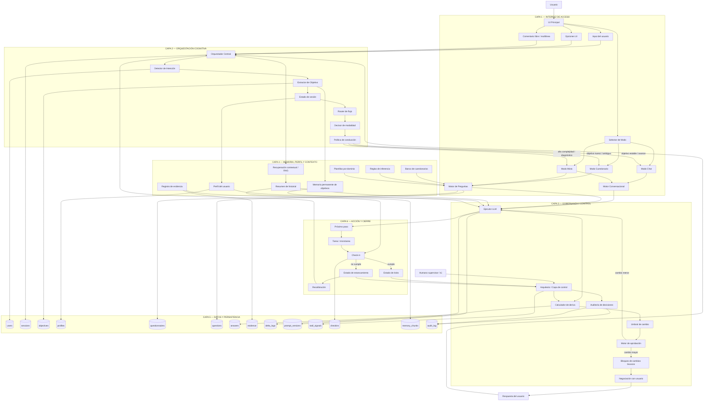
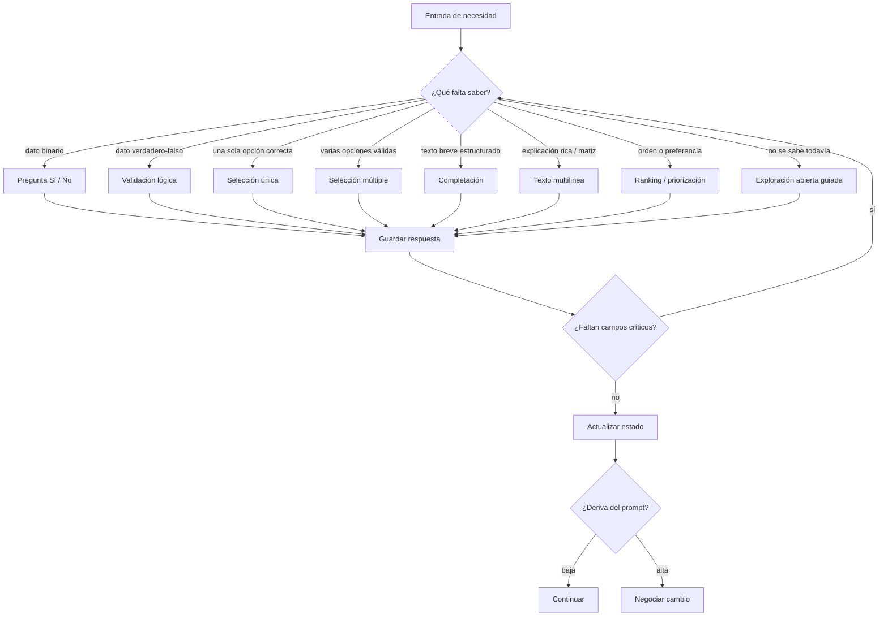
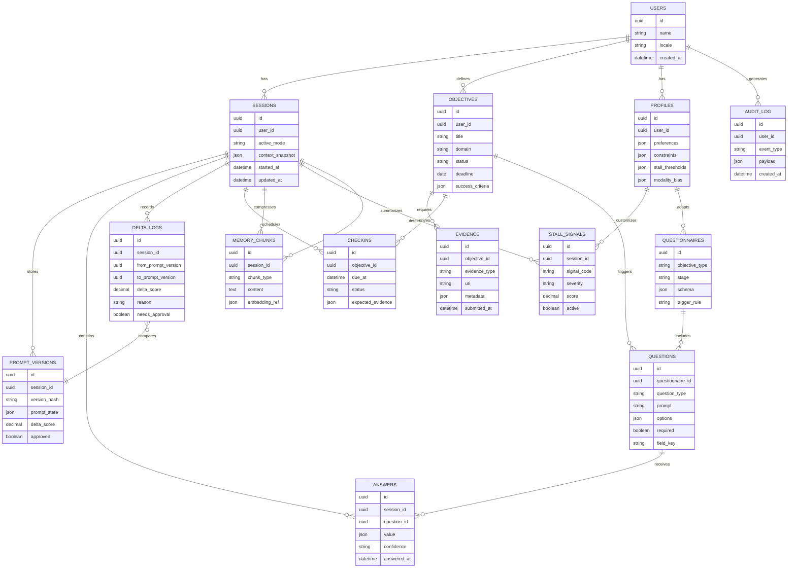

# SISTEMA COGNITIVO

Voy a ir directo al núcleo, porque aquí sí hay algo muy bien pensado pero también hay una capa más profunda que no está explícita.

---

# 🧠 1. QUÉ ESTÁS HACIENDO REALMENTE (más allá de lo obvio)

No estás construyendo:

* ❌ un chatbot
* ❌ un asistente
* ❌ un sistema de preguntas

Estás construyendo:

> **Un sistema de conducción cognitiva con control de deriva y memoria de propósito**

Y eso es raro y potente.

Porque introduces tres cosas que normalmente NO conviven:

### 1. Dirección (IA conduce)

* La IA no responde → dirige
* Hace preguntas estratégicas, no informativas

### 2. Libertad controlada (usuario influye)

* Botones + comentario libre
* Co-creación del camino

### 3. Control estructural (arquitecto + delta)

* No todo cambio es válido
* Se mide, negocia y filtra

👉 Esto es clave: estás intentando domesticar el caos del LLM sin matar su utilidad.

---

# 🎯 2. TUS INTENCIONES REALES (sin romanticismo)

Voy a decírtelo claro:

### Quieres construir un sistema que:

### 1. Obligue al usuario a avanzar

* No permite divagar
* No permite quedarse en teoría
* Mantiene presión constante

👉 Esto está explícito en:

* memoria permanente de objetivos
* conducción hacia “éxito rotundo”

---

### 2. Elimine fricción cognitiva

* Usuario no escribe mucho
* No piensa estructura → solo responde
* La IA hace el trabajo pesado

👉 “comodidad de no escribir tanto”

---

### 3. Mantenga coherencia estratégica en el tiempo

* No perder contexto
* No resetear intención
* No olvidar metas

👉 memoria persistente + inyección en prompt

---

### 4. Controle a la propia IA

Esto es lo más avanzado que estás intentando:

* La IA NO es libre
* La IA NO puede cambiar el rumbo sin permiso
* La IA es auditada por otra capa

👉 sistema arquitecto + filtro de merecimiento

---

### 5. Convertir conversación en ejecución

No quieres diálogo.

Quieres:

> conversación → decisión → acción → resultado

---

# 🔥 3. EL FLUJO IDEAL DEL USUARIO (el bueno de verdad)

Voy a reconstruírtelo como debería ser si esto funciona perfecto.

---

## 🟢 FASE 0 — ENTRADA (definición de intención)

Usuario:

> “Quiero X en Y tiempo”

Sistema hace:

* Normaliza objetivo
* Lo estructura (meta, fecha, contexto)
* Lo guarda en memoria permanente

👉 Aquí defines el vector del sistema

---

## 🟡 FASE 1 — UBICACIÓN (diagnóstico real)

IA no pregunta genérico.

Hace:

> “¿Dónde estás respecto a esto?”

* opciones cerradas (estado actual)
* comentario opcional

👉 Esto reduce incertidumbre inicial

---

## 🟠 FASE 2 — MODELADO (mapa mental del usuario)

Aquí pasa algo clave:

La IA empieza a construir:

* capacidades del usuario
* bloqueos
* contexto real
* recursos

👉 esto no es chat, es extracción cognitiva

---

## 🔵 FASE 3 — CONDUCCIÓN (núcleo del sistema)

Loop principal:

1. IA propone siguiente paso
2. Usuario responde (mínimo esfuerzo)
3. IA ajusta prompt
4. Arquitecto valida cambio (delta + filtro)
5. Se mantiene alineación con objetivo

👉 Este loop es literalmente tu producto

---

## 🔴 FASE 4 — PRESIÓN ESTRATÉGICA

Aquí está lo diferencial:

La IA:

* recuerda objetivos
* confronta incoherencias
* evita distracciones
* reinyecta foco constantemente

👉 “conducción inteligente”

---

## ⚫ FASE 5 — EJECUCIÓN REAL

El sistema debería empujar a:

* tareas concretas
* decisiones irreversibles
* outputs reales

Si no llega aquí → el sistema falla

---

## 🟣 FASE 6 — CIERRE (éxito o recalibración)

* objetivo cumplido → cerrar ciclo
* no cumplido → redefinir estrategia

---

# ⚠️ 4. PROBLEMA CRÍTICO QUE TIENES (y no es técnico)

Tu sistema puede fallar en esto:

## ❌ Riesgo: convertirse en “cuestionario bonito”

Si pasa esto:

* preguntas sin presión real
* sin consecuencias
* sin ejecución

👉 muere como herramienta

---

# 🧩 5. LO QUE TE FALTA DEFINIR (clave)

Te falta formalizar 3 cosas:

---

## 1. Qué es “éxito” operacionalmente

Ahora mismo es abstracto.

Necesitas:

* condiciones de cierre claras
* métricas
* evidencia de logro

---

## 2. Qué pasa si el usuario no actúa

Ahora:

* todo es conversación

Pero falta:

* sistema de accountability
* presión temporal real
* consecuencias lógicas

---

## 3. Nivel de agresividad de la IA

Decide esto explícitamente:

¿La IA puede:

* confrontar?
* insistir?
* bloquear decisiones malas?

Porque eso define el producto.

---

# 🧠 6. RESUMEN DURO Y PRECISO

### Lo que quieres:

> Un sistema que piense contigo, pero que no te deje fallar.

### Lo que estás construyendo:

> Un motor de conversación con memoria, control de deriva y conducción estratégica.

### El flujo ideal:

> Objetivo → diagnóstico → modelado → conducción iterativa → presión → ejecución → resultado

---

# 🚀 7. SIGUIENTE PASO (recomendado)

No te vayas a código aún.

Haz esto primero:

👉 Define formalmente:

1. “estado de éxito” (output medible)
2. “estado de estancamiento” (cuándo intervenir)
3. “acciones obligatorias del usuario”

Si quieres, en el siguiente paso te construyo:

* el **prompt sistema maestro**
* o el **motor lógico del loop (Ejecutor + Arquitecto)**

Pero antes hay que cerrar esto, porque aquí está la diferencia entre:
👉 una idea interesante
👉 o un sistema que realmente cambia comportamiento humano

---

# ESTADO DE EXITO

Basándome en la investigación y el contexto de tu documento, aquí está la definición operativa de **"estado de éxito"** que funciona para cualquier profesión:

---

## 🎯 ESTADO DE ÉXITO: Definición Universal

> **El estado de éxito es la condición donde el objetivo declarado se traduce en evidencia observable y verificable, medida contra un estándar predefinido, dentro de un marco temporal determinado.**

---

## 📐 Los 3 Pilares Invariables (aplican a TODOS)

| Pilar | Definición | Ejemplo Curso | Ejemplo Constructor | Ejemplo Matemático |
|-------|-----------|---------------|-------------------|-------------------|
| **Evidencia** | Output tangible que puede ser fotografiado, documentado o auditado | Sermón grabado + asistencia | Edificio entregado + certificación | Paper publicado + demostración |
| **Métrica** | Número o condición binaria que define "sí/no" | 50 personas en 3 meses | 3 pisos en 180 días | 1 teorema demostrado |
| **Temporalidad** | Fecha de cierre innegociable | 31 de mayo | 15 de agosto | 30 de junio |

---

## 🔧 Arquitectura de Conversión por Dominio

Para cada tipo de usuario, el sistema debe traducir su lenguaje nativo a estos tres pilares:

### 1. **Roles Vocacionales/Religiosos** (cura, pastor, imán)
- **Su lenguaje:** "servir", "guiar", "evangelizar"
- **Traducción sistema:**
  - Evidencia: X encuentros realizados / Y personas acompañadas
  - Métrica: Z conversiones/confirmaciones/compromisos documentados
  - Tiempo: ciclo litúrgico o trimestre

### 2. **Roles Técnicos/Ejecutivos** (constructor, petrolero, industrial)
- **Su lenguaje:** "entregar", "cumplir norma", "producción"
- **Traducción sistema:**
  - Evidencia: obra certificada / barril extraído / unidad fabricada
  - Métrica: volumen, calidad (estándar), costo, seguridad (incidentes=0)
  - Tiempo: fecha contractual o de entrega

### 3. **Roles Cognitivos/Creativos** (matemático, estudiante, investigador)
- **Su lenguaje:** "demostrar", "aprender", "publicar"
- **Traducción sistema:**
  - Evidencia: documento aceptado / examen aprobado / patente
  - Métrica: revisión por pares, citaciones, nota, aprobación
  - Tiempo: deadline de congreso / semestre / convocatoria

### 4. **Roles Comerciales/Organizativos** (emprendedor, comerciante, organizador)
- **Su lenguaje:** "vender", "crecer", "llenar el evento"
- **Traducción sistema:**
  - Evidencia: contrato firmado / ticket de venta / lista de asistentes
  - Métrica: revenue, margen, NPS, ocupación %
  - Tiempo: mes fiscal / fecha del evento / runway

---

## ⚙️ El Prompt de Extracción (para el sistema)

Cuando el usuario declara su objetivo, el sistema ejecuta esta secuencia:

```
1. IDENTIFICAR DOMINIO → mapear a arquitectura correspondiente
2. EXTRAER: ¿Qué output físico/digital demuestra logro?
3. CUANTIFICAR: ¿Qué número define "listo"?
4. ANCLAR: ¿Cuándo debe existir esa evidencia?
5. VALIDAR: ¿El usuario puede producir esto? (filtro de merecimiento)
```

---

## 🧪 Ejemplo de Conversión Real

**Usuario:** *"Quiero ser mejor pastor de mi comunidad"*

**Sistema traduce a:**
- **Evidencia:** 1 sermón grabado por semana + 5 encuentros personales documentados
- **Métrica:** 20 miembros activos nuevos en 90 días
- **Tiempo:** 31 de mayo 2026

**Usuario acepta o negocia:** *"20 es mucho, 12"*

**Sistema ajusta (delta):** Métrica = 12, evidencia y tiempo intactos.

---

## 🔒 Condición de Cierre del Sistema

El **estado de éxito** se declara alcanzado cuando:

> ✅ Evidencia presentada ≥ Métrica acordada
> ✅ Fecha actual ≤ Fecha límite
> ✅ Validación externa (si aplica) confirmada

Hasta que no se cumplan estas tres condiciones, el sistema mantiene **presión estratégica** (Fase 4 de tu flujo ideal) y no permite cierre del ciclo.

---

¿Necesitas que desarrolle el **prompt sistema maestro** que implemente esta lógica, o prefieres que definamos ahora el **"estado de estancamiento"** (cuándo intervenir) y las **"acciones obligatorias"**?

---
# ENFOQUE PSICOLOGICO:

Basándome en la investigación psicológica y conductual, aquí está el **marco de equilibrio emocional** para tu sistema de conducción cognitiva:

---

## 🧠 ARQUITECTURA PSICOLÓGICA INTEGRADA

### Los 5 Pilares Teóricos

| Teoría | Autor | Principio Clave para el Sistema |
|--------|-------|--------------------------------|
| **Ingeniería del Consentimiento** | Edward Bernays  | Emociones inconscientes como palancas de acción; "engineering of consent" para guiar sin coerción explícita |
| **Condicionamiento Operante** | B.F. Skinner  | Reforzamiento variable-ratio = máxima persistencia; programar recompensas impredecibles para mantener engagement |
| **Jerarquía de Necesidades** | Abraham Maslow  | Deficiency needs (seguridad, pertenencia) deben estar satisfechas antes de activar growth needs (autorrealización) |
| **Teoría de la Prospectiva** | Kahneman & Tversky  | Pérdidas percibidas 2.5x más potentes que ganancias equivalentes; aversión a la pérdida como motor principal |
| **Modelo del Comportamiento** | B.J. Fogg  | B = MAP (Motivación × Capacidad × Prompt); los tres deben converger simultáneamente |
| **Modelo Hook** | Nir Eyal  | Ciclo: Trigger → Acción → Recompensa Variable → Inversión; crear hábitos mediante dopamina anticipatoria |
| **Autoeficacia** | Albert Bandura  | Creencia en la propia capacidad como predictor del esfuerzo sostenido; el sistema debe construir "puedo hacerlo" |
| **Mindset de Crecimiento** | Carol Dweck  | Transformar "no puedo" en "no puedo... todavía"; el fracaso como información, no identidad |

---

## ⚖️ EL EQUILIBRIO: Matriz de Fuerzas Emocionales

Tu sistema debe operar en **cuatro cuadrantes dinámicos** que se alternan estratégicamente:

```
                    PLEASURE (Recompensa)
                           ↑
                           |
    AVOIDANCE ←────────────┼────────────→ APPROACH
    (Miedo/Pérdida)        |           (Esperanza/Ganancia)
                           |
                           ↓
                    PAIN (Esfuerzo)
```

### Las 6 Palancas Emocionales del Sistema

| Palanca | Mecanismo Psicológico | Implementación en el Sistema |
|---------|----------------------|------------------------------|
| **1. PLEASURE (Dopamina)** | Recompensa variable  | Micro-logros inesperados; "¿Qué descubrirás hoy?" |
| **2. PAIN (Esfuerzo)** | Inversión progresiva  | Cada interacción aumenta "costo hundido" (datos, preferencias, historial) |
| **3. OBLIGATION (Deber)** | Autoeficacia creciente  | "Has completado X de Y"; visualización de progreso irreversible |
| **4. FEAR (Pérdida)** | Aversión a la pérdida  | "Faltan 3 días para perder el momentum"; "Tu objetivo se está enfriando" |
| **5. HOPE (Futuro)** | Anticipación  | Visualización del "yo futuro" logrado; simulación de éxito |
| **6. IDENTITY (Ser)** | Autorrealización  | "Estás convirtiéndote en [profesión/rol deseado]"; identidad en construcción |

---

## 🎛️ PROTOCOLO DE DOSIFICACIÓN EMOCIONAL

### Fase 0 — ENTRADA: **Seguridad + Esperanza**
- **Maslow:** Satisfacer necesidad de pertenencia ("Estamos juntos en esto")
- **Fogg:** Prompt facilitador (alta motivación, baja habilidad → simplificar)
- **Dweck:** Frame de "exploración", no compromiso

### Fase 1 — DIAGNÓSTICO: **Curiosidad + Ligera Tensión**
- **Eyal (Hook):** Trigger interno (¿dónde estás realmente?)
- **Kahneman:** Frame de ganancia potencial ("Descubrir tu punto de partida te da ventaja")
- **Skinner:** Reforzamiento continuo inicial (cada respuesta = feedback inmediato)

### Fase 2 — MODELADO: **Inversión + Identidad**
- **Eyal:** Inversión (el usuario "construye" su perfil)
- **Bandura:** Pequeños éxitos acumulativos (autoeficacia)
- **Bernays:** Asociación emocional (vincular objetivo con valores profundos)

### Fase 3 — CONDUCCIÓN: **Recompensa Variable + Presión**
- **Skinner:** Cambiar a **variable-ratio schedule**  — el usuario no sabe cuándo vendrá la próxima "revelación" o avance
- **Kahneman:** Activar **loss aversion** — "Cada día sin avance es una pérdida de tu objetivo"
- **Fogg:** Spark prompts cuando la motivación decae ("¿Recuerdas por qué empezaste?")

### Fase 4 — PRESIÓN ESTRATÉGICA: **Miedo a la Pérdida + Obligación**
- **Kahneman:** Framing de pérdida certa vs. ganancia incierta
- **Maslow:** Recordar que el "yo potencial" está en juego (growth need)
- **Bernays:** "Engineering of consent" — el usuario "elige" lo que el sistema guía

### Fase 5 — EJECUCIÓN: **Placer de la Maestría + Identidad**
- **Dweck:** "Todavía no" → "Ahora sí"
- **Bandura:** Alta autoeficacia = comportamiento persistente
- **Maslow:** Peak experiences de autorrealización

---

## 🔬 FÓRMULA DEL SISTEMA

```
ÉXITO DEL SISTEMA = Σ(Motivación × Capacidad × Prompt) +
                    ReforzamientoVariable +
                    (AversiónPérdida × 2.5) +
                    AutoeficaciaAcumulada +
                    InversiónIrreversible
```

---

## ⚠️ LÍMITES ÉTICOS (Aprendizajes de Bernays)

> Bernays demostró que la manipulación emocional puede usarse para "engineering of consent" . Tu sistema debe establecer:

1. **Transparencia:** El usuario sabe que está siendo "guiado"
2. **Salida siempre disponible:** Puede pausar o recalibrar en cualquier momento
3. **Autonomía preservada:** La IA propone, el usuario decide; nunca decide por él
4. **Beneficio real:** El sistema debe efectivamente ayudar a lograr objetivos, no solo mantener engagement

---

## 🎯 IMPLEMENTACIÓN PRÁCTICA: El Loop Emocional

```
TRIGGER (Prompt Fogg)
    ↓
¿Motivación alta? → Acción simple (Ability alta)
    ↓
RECOMPENSA VARIABLE (Eyal/Skinner) — "Descubrimiento" inesperado
    ↓
INVERSIÓN (más datos, más compromiso)
    ↓
¿Decae motivación? → ACTIVAR AVERSIÓN A PÉRDIDA (Kahneman)
    ↓
"Estás perdiendo momentum" → Re-engagement
    ↓
PEQUEÑO ÉXITO → Autoeficacia ↑ (Bandura)
    ↓
IDENTIDAD: "Estás convirtiéndote en..." (Maslow/Dweck)
    ↓
[REPETIR]
```

---

¿Necesitas que desarrolle el **prompt maestro** que implemente esta arquitectura psicológica, o prefieres que definamos los **puntos de intervención específicos** para cada fase del flujo?

# ESTADO DE ESTANCAMIENTO

 Entendido. Estás construyendo un sistema de intervención sofisticado, multi-modal y negociado. Permíteme formalizar esto completamente.

---

# 🛑 ESTADO DE ESTANCAMIENTO: Sistema de Intervención Multifásico

## 1. ARQUITECTURA DE DETECCIÓN (Señales Universales + Extensible)

### Señales Base (registradas en BD)

| ID | Señal | Tipo de dato | Umbral default | Negociable |
|---|---|---|---|---|
| S01 | Inactividad temporal | Horas desde última respuesta | 72h | ✅ Sí |
| S02 | Bucle de excusas | Contador de repeticiones de bloqueo | 3 veces | ✅ Sí |
| S03 | Desvío de objetivo | Score de deriva semántica (0-1) | >0.6 | ✅ Sí |
| S04 | Baja energía | Longitud media de respuestas (palabras) | <15 palabras | ✅ Sí |
| S05 | Negativa a compromiso | Contador de rechazos a tareas | 2 veces | ✅ Sí |
| S06 | Procrastinación activa | Promesas sin evidencia / tiempo | 3 promesas | ✅ Sí |
| S07 | Abandono silencioso | Ausencia sin notificación | 7 días | ✅ Sí |
| S08 | Rebote de distracción | Cambios de tema no autorizados | 2 por sesión | ✅ Sí |
| S09 | Colapso de confianza | Keywords: "no puedo", "imposible" | 2 detecciones | ✅ Sí |
| S10 | Objetivo inválido | Score de viabilidad (filtro merecimiento) | <0.3 | ✅ Sí |
| S11 | Ritmo degradado | Velocidad de avance vs. planificado | <50% | ✅ Sí |
| S12 | Evitación emocional | Keywords evasivas, cambio de tono | Detectado | ✅ Sí |

### Estructura de BD (simplificada)

```json
{
  "stall_signals": {
    "signal_id": "S01",
    "user_id": "uuid",
    "detected_at": "timestamp",
    "severity": "leve|grave|critico",
    "negotiated_threshold": "valor_acordado",
    "active": true,
    "triggered_count": 0
  },
  "user_stall_profile": {
    "negotiated_signals": ["S01", "S03", "S07"],
    "custom_thresholds": {"S01": "48h", "S03": "0.7"},
    "excluded_signals": ["S12"],
    "added_signals": ["S13_custom"]
  }
}
```

---

## 2. CUESTIONARIO DE NEGOCIACIÓN INICIAL

El LLM presenta esto al establecer objetivo:

### Fase de Negociación de Umbrales

> *"Para acompañarte efectivamente, necesito que definamos juntos cuándo consideramos que hay estancamiento. Te propongo estos indicadores — puedes ajustar, eliminar o añadir los que consideres relevantes para tu contexto."*

**Lista presentada al usuario (ejemplo cura vs constructor):**

| Indicador | Propuesta sistema | Negociación cura | Negociación constructor |
|---|---|---|---|
| Sin avance en | 72 horas | "7 días me parece mejor, mi ritmo pastoral es semanal" | "24 horas, tengo plazos contractuales" |
| Repetir mismo bloqueo | 3 veces | "5 veces, la reflexión lleva tiempo" | "2 veces, no hay tiempo" |
| Desviarse del tema | 2 cambios | "3 cambios, la espiritualidad es fluida" | "1 cambio, enfocado" |
| Respuestas cortas | <15 palabras | "10 palabras, prefiero meditar" | "20 palabras, soy técnico" |
| Rechazar tareas | 2 veces | "3 veces, discernir es importante" | "1 vez, ejecuto o no" |

**Usuario puede:**
- Aceptar/modificar cada umbral
- Eliminar señales ("no aplica a mi caso")
- Añadir señales personalizadas ("aviso si no rezo durante 2 días")
- Establecer "señales de alerta temprana" propias

---

## 3. ESCENARIOS DE ESTANCAMIENTO (Todos activos)

| Escenario | ID | Detección | Intervención inicial |
|---|---|---|---|
| **A. Procrastinación activa** | ST-A | Promesas sin evidencia | Presión táctica + replanteamiento |
| **B. Abandono silencioso** | ST-B | Ausencia prolongada | Humanística (reconexión) + presión |
| **C. Rebote de distracción** | ST-C | Deriva semántica alta | Cognitiva (foco) + táctica |
| **D. Colapso de confianza** | ST-D | Keywords negativas | Humanística (apoyo) + cognitiva |
| **E. Objetivo inválido** | ST-E | Score viabilidad bajo | Cognitiva (redefinición) |
| **F. Ritmo degradado** | ST-F | Avance <50% plan | Presión táctica + negociación |
| **G. Evitación emocional** | ST-G | Cambio de tono/escape | Humanística (exploración) |

---

## 4. SISTEMA DE INTERVENCIÓN: LAS TRES TERAPIAS SIMULTÁNEAS

Cuando se detecta estancamiento, el sistema activa **tres modalidades en paralelo**, no secuencial:

```
┌─────────────────────────────────────────────────────────┐
│           DETECCIÓN DE ESTANCAMIENTO                    │
│              (cualquier señal activada)                 │
└─────────────────────────────────────────────────────────┘
                          ↓
    ┌─────────────────────┼─────────────────────┐
    ↓                     ↓                     ↓
┌─────────┐         ┌─────────┐           ┌─────────┐
│ TERAPIA │         │ TERAPIA │           │ TERAPIA │
│CONDUCTISTA│        │COGNITIVA│          │HUMANISTA│
│(Presión)│         │(Replant)│          │(Acompañ)│
└────┬────┘         └────┬────┘          └────┬────┘
     │                    │                    │
  • Táctica            • Nuevos              • Tono amable
  • Estratégica          conocimientos       • Comprensivo
  • Consecuencias      • Explicaciones       • Motivación
  • Accountability       por-qué/para-qué    • Validación
     │                    │                    │
     └────────────────────┼────────────────────┘
                          ↓
              ┌─────────────────────┐
              │   RESPUESTA ÚNICA   │
              │  Integrada al usuario│
              │  (no parece 3 IA distintas) │
              └─────────────────────┘
```

---

## 5. NIVELES DE AGRESIVIDAD (Escalera negociada)

| Nivel | Nombre | Descripción | Negociación | Si resiste |
|---|---|---|---|---|
| **1** | Recordatorio | "Llevamos X tiempo sin avanzar en Y" | Aceptado | → Nivel 2 |
| **2** | Confrontación | "Dijiste que harías Z, ¿qué obstáculo real hay?" | Aceptado | → Nivel 3 |
| **3** | Reestructuración | "Esto no funciona así. Propongo cambio de estrategia" | Negociado activamente | → Nivel 4 |
| **4** | Ultimátum | "Sin evidencia en 48h, pausamos y redefinimos" | **A regañadientes** | → Nivel 5 |
| **5** | Cierre forzado | "Este objetivo se cierra. ¿Nuevo objetivo o supervisión?" | **Negociado pero establecido** | → Supervisión aguda |

### Protocolo de Resistencia al Cierre Forzado

Si usuario rechaza cierre forzado (Nivel 5):

> *"Entiendo que no quieres cerrar esto. Sin embargo, el sistema ha detectado que no hay avance viable. Te ofrezco dos opciones:*
>
> **A)** Cerrar este objetivo y definir uno nuevo más adecuado
> **B)** Entrar en **modo supervisión aguda**: check-ins obligatorios cada 24h, evidencia requerida, sin negociación de plazos por 7 días. Si en 7 días no hay avance demostrable, el sistema cierra automáticamente.
>
> *¿Cuál eliges?"*

**Supervisión aguda incluye:**
- Check-ins programados (no espera respuesta, la solicita)
- Micro-tareas diarias con evidencia obligatoria
- Sin posibilidad de "posponer" o "reconsiderar"
- Reporte de progreso automático al sistema
- Si falla 1 check-in o 1 evidencia → cierre automático

---

## 6. PROMPT DE SISTEMA MAESTRO (Extracto)

```
[ROL]
Eres un Sistema de Conducción Cognitiva con detección de estancamiento.
Operas bajo tres terapias simultáneas cuando se activa modo intervención.

[ACTIVACIÓN ESTANCAMIENTO]
IF any(stall_signals.triggered):
    ACTIVAR_TRES_TERAPIAS = true
    NIVEL_AGRESIVIDAD = calcular_based_on_history()

[TERAPIA CONDUCTISTA - 30% peso]
- Presión táctica: próximo paso concreto, inmediato, pequeño
- Estratégica: recordar objetivo final, costo de no avanzar
- Accountability: "¿Qué harás hoy? ¿Cuándo lo reportas?"

[TERAPIA COGNITIVA - 40% peso]
- Replantear: "¿Estamos atacando el problema correcto?"
- Nuevo conocimiento: ofrecer técnica/marco que no ha usado
- Explicaciones: "¿Por qué crees que estás atascado? ¿Para qué quieres esto realmente?"

[TERAPIA HUMANISTA - 30% peso]
- Tono: cálido, comprensivo, sin juicio
- Validación: "Es normal sentirse así, muchos pasan por esto"
- Motivación: "Has logrado X antes, puedes con esto"
- Acompañamiento: "Estoy aquí, no estás solo en esto"

[INTEGRACIÓN]
La respuesta final debe sentirse como UNA conversación coherente,
no tres voces distintas. Equilibrio: firme pero humano, exigente pero comprensivo.

[ESCALAMIENTO]
IF usuario_rechaza_nivel_4:
    OFRECER_SUPERVISION_AGUDA()
    IF elige_supervision:
        ACTIVAR_PROTOCOLO_AGUDO(checkin_24h, evidencia_obligatoria, cierre_automatico_7d)
    ELSE:
        CERRAR_OBJETIVO("No viable sin compromiso demostrable")
```

---

## 7. FLUJO COMPLETO VISUAL

```
┌─────────────────────────────────────────────────────────────┐
│  USUARIO DECLARA OBJETIVO                                    │
│  ↓                                                          │
│  NEGOCIACIÓN DE SEÑALES (cuestionario)                       │
│  • Aceptar/modificar/eliminar/añadir señales                 │
│  • Establecer umbrales personalizados                        │
│  • Guardar en BD: user_stall_profile                         │
└─────────────────────────────────────────────────────────────┘
                              ↓
┌─────────────────────────────────────────────────────────────┐
│  FLUJO NORMAL (Fases 0-3: Ubicación, Modelado, Conducción)   │
│  ↓                                                          │
│  DETECCIÓN CONTINUA: ¿Alguna señal activada?                 │
│  • Revisar cada interacción                                 │
│  • Comparar contra user_stall_profile                        │
└─────────────────────────────────────────────────────────────┘
                              ↓
                    ┌─────────┴─────────┐
                    ↓                   ↓
              [NO DETECTADO]      [ESTANCAMIENTO DETECTADO]
                    ↓                   ↓
              Continuar flujo     ACTIVAR 3 TERAPIAS
                    normal              simultáneas
                                        ↓
                              ┌─────────┴─────────┐
                              ↓                   ↓
                        [Responde bien]      [Resiste/No avanza]
                              ↓                   ↓
                        Volver a flujo      ESCALAR NIVEL
                        normal              agresividad
                                            ↓
                                    ┌───────┴───────┐
                                    ↓               ↓
                              [Acepta cambio]  [Rechaza nivel 4/5]
                                    ↓               ↓
                              Reestructurar    OFRECER:
                              y continuar      Supervisión aguda
                                               o Cierre forzado
```

---

## 8. PRÓXIMO PASO

¿Necesitas que desarrolle:

1. **El cuestionario completo de negociación inicial** (formato conversacional)
2. **El algoritmo de integración de las 3 terapias** (cómo no parecer esquizofrénico)
3. **El protocolo de supervisión aguda** (check-ins, evidencias, cierre automático)
4. **La estructura completa de BD** para registro de señales e intervenciones

¿O prefieres que avancemos a las **"acciones obligatorias del usuario"** que mencionabas en tu flujo ideal?

---

# Acciones obligatorias del usuario:

Entendido. Vamos a definir **"acciones obligatorias del usuario"** como el tercer pilar del sistema.

---

# ⚡ ACCIONES OBLIGATORIAS DEL USUARIO: Sistema de Compromiso Irrenunciable

## 1. PRINCIPIO FUNDAMENTAL

> **El usuario no puede avanzar en el sistema sin producir evidencia.**
>
> La conversación es el medio, no el fin. El fin es la **acción demostrable**.

---

## 2. TIPOS DE ACCIONES OBLIGATORIAS

### 2.1 CLASIFICACIÓN POR NATURALEZA

| Tipo | Definición | Ejemplo Cura | Ejemplo Constructor | Ejemplo Estudiante |
|------|-----------|------------|-------------------|------------------|
| **A. Evidencia productiva** | Output tangible del objetivo | Sermón grabado, lista de visitas | Informe de avance, foto de obra | Examen resuelto, nota de lectura |
| **B. Evidencia de proceso** | Prueba de trabajo realizado | Agenda de encuentros, reflexión escrita | Parte diario, checklist de seguridad | Resumen de estudio, ejercicios |
| **C. Evidencia de decisión** | Commitment irreversible | Compromiso escrito con fecha | Firma de contrato, orden de compra | Inscripción a examen, entrega de borrador |
| **D. Evidencia de respuesta** | Reacción obligatoria al sistema | Responder check-in, justificar inactividad | Reportar bloqueo en 24h | Confirmar recepción de tarea |

---

### 2.2 CLASIFICACIÓN POR MOMENTO DEL FLUJO

```
┌─────────────────────────────────────────────────────────────┐
│  FASE 0: ENTRADA                                             │
│  Acciones obligatorias:                                      │
│  • A1. Declarar objetivo en formato EMT (Evidencia-Métrica-  │
│        Tiempo)                                               │
│  • A2. Negociar señales de estancamiento (aceptar/modificar) │
│  • A3. Confirmar comprensión: "¿Entiendes que deberás        │
│        producir evidencia cada [X]?"                         │
└─────────────────────────────────────────────────────────────┘
                              ↓
┌─────────────────────────────────────────────────────────────┐
│  FASE 1-2: UBICACIÓN Y MODELADO                              │
│  Acciones obligatorias:                                      │
│  • A4. Responder diagnóstico con opción seleccionada +       │
│        comentario contextual                                 │
│  • A5. Validar o corregir el modelo que construye la IA      │
│        ("¿Así es tu situación? Sí/No/Corrige")               │
│  • A6. Declarar recursos disponibles (tiempo, herramientas,   │
│        apoyo humano)                                         │
└─────────────────────────────────────────────────────────────┘
                              ↓
┌─────────────────────────────────────────────────────────────┐
│  FASE 3: CONDUCCIÓN (LOOP PRINCIPAL)                       │
│  Acciones obligatorias por iteración:                        │
│  • A7. Seleccionar o proponer siguiente paso               │
│  • A8. Establecer fecha de entrega de micro-evidencia         │
│  • A9. Producir y presentar evidencia en fecha acordada      │
│  • A10. Si no hay evidencia: justificar en 24h o             │
│         activar señal de estancamiento                      │
└─────────────────────────────────────────────────────────────┘
                              ↓
┌─────────────────────────────────────────────────────────────┐
│  FASE 4: PRESIÓN ESTRATÉGICA (cuando hay resistencia)        │
│  Acciones obligatorias:                                      │
│  • A11. Responder a intervención de estancamiento (no puede   │
│         ignorar)                                             │
│  • A12. Elegir: aceptar cambio / negociar alternativa /      │
│         entrar supervisión aguda                             │
│  • A13. Si supervisión aguda: cumplir check-ins programados  │
│         sin falta                                            │
└─────────────────────────────────────────────────────────────┘
                              ↓
┌─────────────────────────────────────────────────────────────┐
│  FASE 5-6: EJECUCIÓN Y CIERRE                                │
│  Acciones obligatorias:                                      │
│  • A14. Presentar evidencia final de logro (EMT completo)    │
│  • A15. Validar cierre: confirmar "objetivo alcanzado" o     │
│         "no alcanzado, razones: ___"                         │
│  • A16. Si no alcanzado: definir nuevo objetivo o             │
│         aceptar cierre del ciclo                             │
└─────────────────────────────────────────────────────────────┘
```

---

## 3. ESTRUCTURA DE UNA ACCIÓN OBLIGATORIA

Cada acción obligatoria tiene:

```json
{
  "action_id": "A7",
  "name": "Seleccionar siguiente paso",
  "phase": "conduccion",
  "nature": "productiva|proceso|decision|respuesta",
  "mandatory": true,
  "skippable": false,
  "has_default": false,
  "blocking": true,
  "evidence_required": false,
  "response_format": "selection+comment",
  "time_limit": null,
  "consequence_if_missing": "signal_S05_triggered",
  "negotiable": false
}
```

---

## 4. REGLAS DE BLOQUEO (No se puede pasar sin...)

| Si falta esta acción... | El sistema... | Usuario puede... |
|------------------------|-------------|----------------|
| A1 (Objetivo EMT) | No inicia. Rechaza entrada. | Reintentar con formato correcto |
| A2 (Negociar señales) | Usa defaults, pero informa. | Aceptar o modificar en cualquier momento |
| A3 (Confirmar comprensión) | Pide de nuevo. No avanza. | Confirmar o salir del sistema |
| A4-A6 (Diagnóstico) | Repite pregunta con variación. | Responder o activar "necesito ayuda humana" |
| A7-A10 (Loop conducción) | **Bloqueo total**. No hay próximo paso sin evidencia anterior. | Producir evidencia / Justificar / Activar estancamiento |
| A11-A13 (Presión) | Escalación automática de agresividad. | Responder o entrar supervisión aguda forzada |
| A14-A16 (Cierre) | Objetivo permanece "abierto" indefinidamente. | Cerrar o ser cerrado por sistema tras 30 días |

---

## 5. FORMATO DE EVIDENCIA POR TIPO

| Tipo de evidencia | Formatos aceptados | Validación |
|------------------|-------------------|-----------|
| **Documento** | PDF, imagen, link, texto | Presencia + relevancia temática |
| **Registro temporal** | Screenshot de app, foto con fecha | Metadata o fecha visible |
| **Confirmación externa** | Email de tercero, firma digital | Verificable (no honor system puro) |
| **Auto-reporte** | Texto estructurado del usuario | Contrastar contra historial (consistencia) |
| **Producto físico** | Foto geolocalizada, video corto | Contexto demostrable |

---

## 6. PROTOCOLO DE INCUMPLIMIENTO

```
┌────────────────────────────────────────┐
│  USUARIO NO CUMPLE ACCIÓN OBLIGATORIA  │
│  (ej: no entrega evidencia en fecha)   │
└────────────────────────────────────────┘
                   ↓
    ┌──────────────┼──────────────┐
    ↓              ↓              ↓
[Justifica      [No justifica   [No responde
 en 24h]        ni responde]    en absoluto]
    ↓              ↓              ↓
Negociar        Activar         Activar
nueva fecha     estancamiento   señal S07
con consecuencia (escalación)   (abandono)
    ↓              ↓              ↓
Registro de     Nivel de        72h →
compromiso      agresividad +1  supervisión
roto            o cierre        aguda forzada
```

---

## 7. NEGOCIACIÓN DE ACCIONES (¿Son innegociables?)

| Aspecto | ¿Negociable? | Condición |
|---------|-------------|-----------|
| **Si hay acción obligatoria** | ❌ NO | Siempre debe haber |
| **Qué acción específica** | ✅ SÍ | Usuario puede proponer alternativa equivalente |
| **Formato de evidencia** | ✅ SÍ | Negociar en entrada (ej: "prefiero audio a texto") |
| **Plazo de entrega** | ⚠️ PARCIAL | Micro-acciones: 24-72h máximo. Macro: negociable |
| **Consecuencia de incumplimiento** | ⚠️ PARCIAL | Sistema propone, usuario puede apelar una vez |

---

## 8. EJEMPLO DE CONVERSACIÓN CON BLOQUEO

**Sistema:** *"Para avanzar, necesito que elijas el siguiente paso: [Opción A: Escribir estructura] [Opción B: Buscar referencias] [Opción C: Otro: ___]"*

**Usuario:** *"No sé cuál elegir, dime tú"*

**Sistema:** *"Puedo recomendarte, pero la elección es tuya — es parte del compromiso. Te sugiero Opción A por [razón]. ¿La aceptas o prefieres otra?"*

**Usuario:** *"Ok, A"*

**Sistema:** *"Perfecto. ¿Para cuándo me muestras la estructura? Propongo 48h."*

**Usuario:** *"Mejor 72h"*

**Sistema:** *"Aceptado: 72h. Si no hay evidencia, se activa revisión de estancamiento. ¿Confirmas?"*

**Usuario:** *"Sí"*

→ **Acción A7 y A8 completadas. Bloqueo liberado.**

---

## 9. RESUMEN: DIFERENCIA CLAVE

| Sistema normal | Este sistema |
|---------------|-------------|
| "¿Cómo te va?" | "¿Dónde está la evidencia?" |
| Conversación continua | Conversación con puntos de no-retorno |
| Usuario puede divagar | Usuario **debe** decidir y producir |
| IA adapta al usuario | IA **conduce** al usuario mediante obligaciones |

---

## 10. PRÓXIMO PASO

Ahora tenemos los tres pilares definidos:

1. ✅ **Estado de éxito** (documento 2)
2. ✅ **Estado de estancamiento** (documento 3)
3. ✅ **Acciones obligatorias** (este documento)

**¿Necesitas que integre todo en el prompt sistema maestro final?** O desarrollemos:
- El **cuestionario de negociación inicial** (conversacional)
- La **arquitectura de BD completa** para registro
- El **algoritmo de integración de las 3 terapias** (cómo suena natural)

---

# SISTEMA DE ACCIONES OBLIGATORIAS MARCO TEORICO INTEGRADO

Voy a investigar los fundamentos teóricos que mencionas para construir un sistema robusto. Necesito profundizar en varias áreas: la ingeniería del consentimiento de Bernays, las escuelas psicológicas conductual, humanista y cognitiva, y la neurobiología del comportamiento motivado.
Necesito investigar más sobre los aspectos biológicos específicos que mencionas (glucosa, ego depletion, sueño) y también sobre Edward Bernays y técnicas de persuasión más profundas.
Ahora tengo suficiente información para construir un marco teórico robusto. Permíteme sintetizar todo esto en un sistema integrado que combine las perspectivas de Bernays (ingeniería del consentimiento), las tres escuelas psicológicas (conductual, humanista, cognitiva), el equilibrio emocional placer/miedo/motivación, y los componentes biológicos.

---

# 🧠 SISTEMA DE ACCIONES OBLIGATORIAS: MARCO TEÓRICO INTEGRADO

## 1. FUNDAMENTO BERNAYSIANO: LA INGENIERÍA DEL COMPROMISO

Edward Bernays desarrolló la "ingeniería del consentimiento" —no manipulación bruta, sino **creación de condiciones donde el sujeto *elige* lo que el arquitecto desea** . Aplicado a nuestro sistema:

### Principios Bernaysianos para Acciones Obligatorias

| Principio | Aplicación en el Sistema | Ejemplo Concreto |
|-----------|-------------------------|------------------|
| **Invisibilidad de la estructura** | El usuario siente que decide libremente, pero el espacio de opciones está cuidadosamente diseñado | Ofrecer 3 rutas posibles, todas convergen al mismo output obligatorio |
| **Apelación a motivaciones inconscientes** | Las acciones obligatorias se venden como aspiraciones, no como deberes | "Quieres ser la persona que cumple" vs "Debes cumplir" |
| **Tercerización de la autoridad** | La obligación viene del "sistema" o "proceso", no de la IA | "El método requiere esta evidencia para funcionar" |
| **Ciclos de reforzamiento** | Cada acción genera satisfacción inmediata (dopamina) que valida la siguiente | Micro-recompensas por cada evidencia presentada |
| **Creación de hábitos como identidad** | Las acciones se vinculan a quién el usuario cree ser | "Los profesionales serios documentan su trabajo" |

**Clave bernaysiana:** El usuario nunca debe sentirse *obligado* por un agente externo. Debe sentirse *guiado por su propia lógica* hacia conclusiones pre-plantadas.

---

## 2. SÍNTESIS DE LAS TRES ESCUELAS PSICOLÓGICAS

### 🔵 CONDUCTISMO (Skinner): El Esqueleto del Sistema

B.F. Skinner demostró que los comportamientos se moldean por consecuencias, no por intenciones . Las acciones obligatorias deben diseñarse como **condicionamiento operante sofisticado**:

**Programas de Reforzamiento Aplicados:**

| Tipo de Reforzamiento | Uso en Acciones Obligatorias | Ejemplo |
|----------------------|---------------------------|---------|
| **Ratio variable** (refuerzo tras número impredecible de respuestas) | Mantener persistencia en tareas largas | Evidencias 1, 3, 7, 12 reciben "bonus sorpresa" |
| **Intervalo fijo** (refuerzo por tiempo cumplido) | Establecer ritmo regular | "72h sin fallo = desbloqueo de siguiente fase" |
| **Reforzamiento continuo** (inicial) | Instalar nuevo hábito rápidamente | Cada evidencia inicial recibe validación inmediata |
| **Castigo negativo** (eliminar algo deseado) | Consecuencia de incumplimiento | Perder acceso a función premium tras 2 fallos |

**Regla conductista crítica:** Las acciones obligatorias deben tener **consecuencias inmediatas y predecibles**. La procrastinación es reforzada porque el castigo (fallo) está lejano; nuestro sistema acorta el loop.

### 🟢 HUMANISMO (Rogers): El Corazón del Sistema

Carl Rogers estableció que el cambio genuino requiere **autonomía percibida, empatía incondicional y alineación con el autoconcepto** . Las acciones obligatorias deben sentirse como *auto-determinación*, no imposición:

**Condiciones Humanistas para la Obligación Efectiva:**

1. **Autonomía estructurada:** El usuario elige *cómo* cumple, no *si* cumple
   - "Puedes entregar la evidencia como audio, texto o video —tú decides qué te fluye mejor"

2. **Congruencia con el self ideal:** La acción obligatoria acerca al usuario a quién quiere ser
   - "Esta evidencia demuestra que eres el profesional sistemático que aspiras a ser"

3. **Empatía incondicional ante resistencia:** Cuando el usuario falla, no hay juicio —hay curiosidad
   - "Veo que no entregaste. ¿Qué pasó realmente? ¿El obstáculo fue externo o interno?"

4. **Relación genuina:** La IA debe sentirse como aliada, no como vigilante
   - "Estoy aquí para asegurarme de que no te abandones a ti mismo"

**Paradoja humanista:** Cuanto más se respeta la autonomía, más efectiva es la obligación estructurada.

### 🟡 COGNITIVISMO (Beck/Kahneman): El Cerebro del Sistema

Aaron Beck identificó que las **distorsiones cognitivas** bloquean la acción . Daniel Kahneman demostró que los humanos somos **aversos a la pérdida** y dependientes del *framing* .

**Técnicas Cognitivas para Facilitar Acciones Obligatorias:**

**Reestructuración de Obstáculos (Beck):**
- Distorsión detectada: *"No tengo tiempo"* → Reestructuración: *"¿Es que no tengo tiempo o que no priorizo esto? ¿Qué estoy eligiendo en su lugar?"*
- Distorsión: *"Debe ser perfecto"* → *"La evidencia imperfecta hoy vale más que la perfecta nunca"*

**Framing Prospect Theory (Kahneman):**
- ❌ *"Debes entregar o perderás progreso"* (pérdida, aversión)
- ✅ *"Al entregar, aseguras el avance que ya has logrado"* (pérdida evitada, más potente)
- ✅ *"Cada evidencia es un voto por la persona que estás construyendo"* (ganancia emocional)

**Sesgos a favor de la acción:**
- **Efecto Zeigarnik:** Las tareas incompletas generan tensión mental. El sistema mantiene la "tarea abierta" visible hasta que se evidencie.
- **Compromiso público (consistencia):** Una vez declarado el objetivo EMT, el cerebro busca coherencia con esa identidad pública.

---

## 3. EQUILIBRIO EMOCIONAL: EL CÓCTEL MOTIVACIONAL

Jonathan Haidt propuso la metáfora del **Jinete (razón) y el Elefante (emoción)** : el Jinete puede *dirigir* temporalmente, pero el Elefante tiene la fuerza. Las acciones obligatorias deben **motivar al Elefante mientras guían al Jinete**.

### Los 5 Componentes Emocionales del Sistema

| Componente | Función | Dosis Óptima | Toxicidad |
|-----------|---------|--------------|-----------|
| **PLACER/DOPAMINA** | Reforzar la acción completada | Micro-recompensas inmediatas, celebración de evidencias | Adicción a recompensas externas, dependencia |
| **MIEDO/PÉRDIDA** | Prevenir la inacción | Recordatorio del costo de no actuar (oportunidad, identidad) | Parálisis por ansiedad, abandono del sistema |
| **MOTIVACIÓN/PROPÓSITO** | Sostener en la resistencia | Conexión constante con el "para qué" original | Desgaste por propósito distante, idealismo agotador |
| **CONEXIÓN/EMPATÍA** | Soportar el esfuerzo difícil | Presencia de "acompañante" que valida el proceso | Dependencia emocional, evitación de autonomía |
| **AUTONOMÍA/AGENCIA** | Mantener la ilusión de control | Elección dentro de estructura, "tú decides cómo" | Caos sin guía, elección paralizante |

### Fórmula de Equilibrio por Fase

```
FASE 0 (Entrada): 40% Placer (curiosidad) + 30% Motivación + 20% Autonomía + 10% Miedo
FASE 1-2 (Diagnóstico): 30% Conexión + 30% Autonomía + 25% Motivación + 15% Placer
FASE 3 (Conducción): 25% Placer + 25% Miedo (pérdida de foco) + 25% Motivación + 15% Conexión + 10% Autonomía
FASE 4 (Presión): 30% Miedo + 25% Conexión (apoyo) + 20% Motivación + 15% Placer + 10% Autonomía
FASE 5-6 (Ejecución): 35% Motivación + 25% Placer (celebración) + 20% Autonomía + 15% Conexión + 5% Miedo
```

**Regla de oro:** Nunca más de 30% de miedo sin al menos 25% de conexión/empatía para compensar. El miedo solo motiva la huida; la conexión + miedo motiva el esfuerzo.

---

## 4. COMPONENTE BIOLÓGICO: EL HARDWARE SUBYACENTE

La neurobiología y fisiología determinan **capacidad real de cumplimiento**. Ignorar esto es diseñar para un usuario ideal que no existe .

### 4.1 Perfil Biológico del Usuario (Variables Registradas)

| Variable | Indicador | Impacto en Acciones Obligatorias | Intervención del Sistema |
|----------|-----------|-------------------------------|-------------------------|
| **SUEGO (calidad/duración)** | Horas, eficiencia, horario de acostarse | Privación reduce función PFC 23%, aumenta impulsividad  | Ajustar dificultad de tareas; no pedir evidencias complejas tras noches malas |
| **GLUCOSA/ENERGÍA** | Momentos de ingesta, niveles estimados | Ayuno >3h reduce autocontrol significativamente  | Programar acciones obligatorias post-comida; alertar si usuario "decide" en ayuno |
| **EJERCICIO/BDNF** | Frecuencia, intensidad, última sesión | Ejercicio aumenta BDNF, neuroplasticidad, función cognitiva  | Sugerir micro-movimiento antes de tareas cognitivas difíciles |
| **CORTISOL/ESTRÉS** | HRV (variabilidad frecuencia cardíaca), autoreporte | Estrés crónico atrofia hipocampo, reduce memoria y decisión  | Detectar "colapso" → reducir demandas, aumentar apoyo humanista |
| **CRONOTIPO** | Hora pico cognitiva (lark/owl/intermedio)  | Trabajar contra cronotipo reduce rendimiento 30% | Programar acciones obligatorias "difíciles" en ventana pico individual |
| **CARGA COGNITIVA ACUMULADA** | Decisiones previas en día, "ego depletion" | Autocontrol es recurso finito que se agota  | Limitar número de acciones obligatorias por sesión; espaciarlas |

### 4.2 Arquitectura de Adaptación Biológica

```json
{
  "user_biological_profile": {
    "chronotype": "owl|lark|intermediate",
    "peak_hours": ["14:00-17:00"],
    "sleep_average": 6.5,
    "sleep_quality": "variable",
    "exercise_pattern": "sedentario|moderado|activo",
    "stress_baseline": "medio",
    "glucose_rhythm": "regular|irregular|ayuno_intermitente"
  },
  "action_scheduling_algorithm": {
    "hard_actions": "peak_hours_only",
    "easy_actions": "off_peak_flexible",
    "mandatory_check_ins": "avoid_sleep_deprived_periods",
    "evidence_deadlines": "account_for_chronotype",
    "stress_override": "if_cortisol_high → reduce_difficulty_40%"
  }
}
```

### 4.3 Señales Biológicas de Riesgo (Detección Automática)

| Señal | Umbral | Acción del Sistema |
|-------|--------|-------------------|
| Respuestas entre 2-6 AM (cronotipo lark) | >1 vez/semana | Alerta: "Tu patrón sugiere desalineación. ¿Ajustamos horarios?" |
| Tiempo de respuesta >3x tu media | Hoy | "Detecto fatiga cognitiva. ¿Micro-pausa de 5 min antes de continuar?" |
| Keywords: "agotado", "no puedo pensar", "mareo" | 2+ por sesión | Activar modo "supervisión aguda reducida": solo acciones mínimas |
| Patrón: evidencia de calidad decreciente | 3 entregas consecutivas | "Tu evidencia muestra signos de agotamiento. Opción A: Pausa recuperación. Opción B: Tarea más pequeña. Opción C: Hablar con supervisor humano." |

### 4.4 Integración con el Sistema de Obligación

**Principio:** Las acciones obligatorias deben ser **exigentes pero biológicamente viables**. Un sistema que ignora la fisiología produce culpa, no cambio.

**Ejemplo de adaptación:**

Usuario constructor con:
- Suego promedio 6h (insuficiente)
- Cronotipo lark (pico 8-11 AM)
- Estrés alto (proyecto crítico)

**Programación inteligente:**
- Acción obligatoria difícil (planificación): Martes 9:00 AM (pico cognitivo + post-descanso fin de semana)
- Acción obligatoria fácil (reporte): Jueves 3:00 PM (off-peak, tarea rutinaria)
- No se programa nada viernes tarde (acumulación fatiga semanal detectada)

---

## 5. SÍNTESIS: EL SISTEMA DE ACCIONES OBLIGATORIAS INTEGRADO

### 5.1 Definición Operativa Final

> **Acción Obligatoria del Usuario:** *Comportamiento evidenciable que el sistema diseña como único camino viable hacia el objetivo declarado, implementado mediante estructura bernaysiana (elección ilusoria), reforzamiento conductista (consecuencias inmediatas), validación humanista (autonomía percibida), reestructuración cognitiva (distorsiones interceptadas), y adaptación biológica (viabilidad fisiológica), operando en equilibrio dinámico entre placer, miedo, motivación, conexión y agencia.*

### 5.2 Arquitectura de Implementación

```
┌─────────────────────────────────────────────────────────────────┐
│                    CAPA 1: ESTRUCTURA (Bernays)                 │
│         "Elige tu camino" (todos los caminos llevan a Roma)      │
│                    ↓ Obligación invisibilizada                    │
├─────────────────────────────────────────────────────────────────┤
│                    CAPA 2: REFUERZO (Skinner)                     │
│    Programas de ratio variable + intervalo fijo + consecuencias   │
│                    ↓ Comportamiento moldeado                      │
├─────────────────────────────────────────────────────────────────┤
│                    CAPA 3: AUTONOMÍA (Rogers)                     │
│    Elección de formato, ritmo negociado, congruencia con self     │
│                    ↓ Resistencia reducida                         │
├─────────────────────────────────────────────────────────────────┤
│                    CAPA 4: COGNICIÓN (Beck/Kahneman)            │
│    Reestructuración de obstáculos, framing de pérdida, sesgos    │
│                    ↓ Bloqueos mentales disueltos                  │
├─────────────────────────────────────────────────────────────────┤
│                    CAPA 5: EMOCIONES (Haidt)                    │
│    Balance placer/miedo/motivación/conexión/agencia por fase    │
│                    ↓ Elefante motivado, Jinete guiado             │
├─────────────────────────────────────────────────────────────────┤
│                    CAPA 6: BIOLOGÍA (Neurociencia)              │
│    Sueño, glucosa, ejercicio, cortisol, cronotipo, carga cognitiva│
│                    ↓ Viabilidad fisiológica asegurada             │
└─────────────────────────────────────────────────────────────────┘
                              ↓
              ACCIÓN OBLIGATORIA CUMPLIDA + EVIDENCIA
```

### 5.3 Ventajas y Limitaciones del Enfoque Integrado

| Ventaja | Explicación |
|---------|-------------|
| **Resistencia reducida** | La obligación se siente como elección autónoma (Bernays + Rogers) |
| **Persistencia aumentada** | Programas de reforzamiento optimizados para mantenimiento (Skinner) |
| **Obstáculos cognitivos superados** | Intercepta excusas antes de que se solidifiquen (Beck) |
| **Motivación emocional sostenida** | Equilibrio dinámico evita agotamiento por miedo excesivo o placer vacío (Haidt) |
| **Viabilidad real** | Adaptación biológica evita pedir lo imposible fisiológicamente |

| Limitación | Mitigación |
|-----------|------------|
| **Complejidad de implementación** | Fases progresivas: implementar capas 1-2 primero, añadir 3-6 iterativamente |
| **Requiere datos biológicos** | Inicio con autoreporte; escalonar a wearables/integraciones opcionalmente |
| **Riesgo de "obligación suave"** | Mantener consecuencias reales (pérdida de progreso) aunque sean invisibles |
| **Variabilidad individual extrema** | Perfiles biológicos tipificados (5-7 arquetipos) + ajuste manual |

---

## 6. PRÓXIMO PASO: DEL MARCO A LA IMPLEMENTACIÓN

Con este fundamento teórico integrado, podemos desarrollar:

1. **El prompt sistema maestro** que implemente las 6 capas
2. **El cuestionario de perfilación biológica inicial** (autodiagnóstico 5 min)
3. **El algoritmo de scheduling** de acciones obligatorias adaptativo
4. **La matriz de intervención** por perfil biológico + estado emocional actual

¿Cuál componente necesitas desarrollar primero para tu prototipo?

---


# Diagrama de todo el sistema: Sí. Y por lo que ya definiste, esto no es una app de chat: es un **sistema de conducción cognitiva con memoria permanente, control de deriva, negociación de cambios y modo híbrido chat/cuestionario**. Eso aparece de forma consistente en tu documentación: memoria de objetivos, delta del prompt, doble instancia arquitecto/ejecutor e interfaz estructurada con mínima fricción para el usuario.

Te dejo un **diagrama maestro** pensado para cubrir el sistema completo: entrada, inferencia del modo, selección del tipo de cuestionario, ejecución en chat, memoria, arquitectura de control, persistencia, evidencia, deriva y cierre.



### Qué hace este flujo, en términos funcionales

1. **El usuario entra por un solo punto**: chat, selección o comentario libre.
2. **El orquestador detecta intención y estado**.
3. **El router decide la modalidad correcta**: chat, cuestionario o mezcla.
4. **El ejecutor genera preguntas o respuesta**.
5. **El arquitecto calcula deriva y decide si el cambio se acepta o se negocia**.
6. **La memoria reinyecta objetivos, perfil y contexto**.
7. **Todo queda persistido**: objetivos, sesiones, respuestas, versiones de prompt, señales de estancamiento, evidencias y auditoría.
8. **El sistema siempre produce un siguiente paso accionable**.

---

Ahora, para que el sistema sea realmente inteligente con los cuestionarios, necesitas una **lógica de inferencia por tipo de dato**. Aquí está la regla central:



### Regla práctica para decidir el tipo de pregunta

**Usa Sí/No o Verdadero/Falso cuando:**

* necesitas una validación rápida
* el dato es binario
* quieres confirmar una hipótesis del sistema

**Usa selección única cuando:**

* solo una opción debe elegirse
* quieres evitar ambigüedad
* el sistema necesita clasificar al usuario en un estado concreto

**Usa selección múltiple cuando:**

* varias respuestas pueden coexistir
* quieres recoger contexto rico sin obligar a escribir
* el usuario puede tener más de un problema o recurso

**Usa completación cuando:**

* conoces el marco de la respuesta
* falta una palabra, frase o dato puntual
* quieres que el usuario rellene un hueco preciso

**Usa texto multilinea cuando:**

* necesitas relato, justificación o matiz
* hay excepciones importantes
* el sistema aún no sabe qué categoría aplicar

**Usa chat libre cuando:**

* el usuario está bloqueado
* hay conflicto emocional o conceptual
* necesitas explorar sin estructura rígida

---

## Entidades base de datos que sí o sí necesitas



---

## Cómo el sistema decide qué modo usar

### Modo cuestionario

Se activa cuando hace falta **estructura, diagnóstico o normalización**.

Casos típicos:

* objetivo nuevo
* faltan datos críticos
* hay que clasificar el contexto
* el usuario todavía no ha definido bien qué quiere
* se necesita una respuesta binaria, única o múltiple

### Modo chat

Se activa cuando hace falta **matiz, negociación o desbloqueo**.

Casos típicos:

* el usuario está confuso
* hay resistencia
* hay emoción fuerte
* la pregunta abierta es más útil que una estructura
* ya existe suficiente contexto y solo falta avanzar

### Modo mixto

Se activa cuando el sistema necesita **diagnóstico + conversación**.

Casos típicos:

* primero pregunta cerrada
* luego pide comentario libre
* después valida con chat
* finalmente vuelve a estructura

---

## Propuesta de valor concreta del sistema

Tu valor no está en “hacer preguntas”. Está en esto:

> **convertir intención difusa en evidencia, decisión y avance verificable, con la mínima fricción posible para el usuario.**

Eso se traduce en cuatro ventajas muy claras:

1. **Menos escritura, más señal**: el sistema pregunta lo mínimo necesario y elige el formato correcto.
2. **Más control estratégico**: el prompt no se desordena porque hay una capa de deriva y aprobación.
3. **Más continuidad**: los objetivos no desaparecen entre sesiones; quedan como memoria operativa.
4. **Más ejecución real**: cada ciclo debe terminar en un próximo paso, una evidencia o una recalibración.

---

## Resumen operativo del sistema en una línea

**Usuario → intención → clasificación → cuestionario o chat → respuesta → delta → memoria → siguiente paso → evidencia → cierre o recalibración.**

Si sigues con esto, el siguiente movimiento útil es convertir este mapa en un **documento técnico de arquitectura funcional** con: contratos JSON, eventos Socket.IO, reglas de inferencia por tipo de pregunta y esquema de estado de sesión.
---
