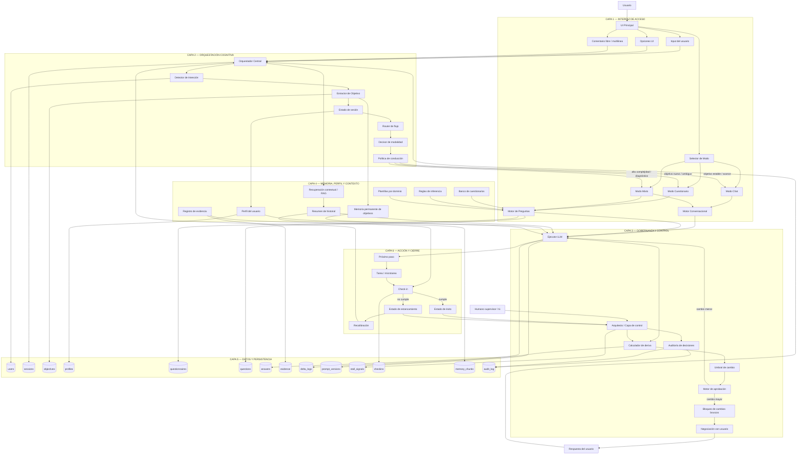

# 🗺️ DIAGRAMA MAESTRO DEL SISTEMA - 6 CAPAS

> **Descripción:** Flujo completo del sistema de conducción cognitiva con todas las capas, desde el usuario hasta la persistencia de datos.  
> **Ubicación original:** `requerimientos.md` (líneas 1269-1478)  
> **Propósito:** Comunicación visual de la arquitectura completa entre usuario e IA.

---

## 📊 DIAGRAMA MERMAID

---

## 📝 DESCRIPCIÓN FUNCIONAL DEL FLUJO

1. **El usuario entra por un solo punto**: chat, selección o comentario libre.
2. **El orquestador detecta intención y estado**.
3. **El router decide la modalidad correcta**: chat, cuestionario o mezcla.
4. **El ejecutor genera preguntas o respuesta**.
5. **El arquitecto calcula deriva y decide si el cambio se acepta o se negocia**.
6. **La memoria reinyecta objetivos, perfil y contexto**.
7. **Todo queda persistido**: objetivos, sesiones, respuestas, versiones de prompt, señales de estancamiento, evidencias y auditoría.
8. **El sistema siempre produce un siguiente paso accionable**.

---

## 🏗️ CAPAS DEL SISTEMA

| Capa | Nombre | Componentes Principales |
|------|--------|------------------------|
| **0** | Actores Externos | Usuario, Humano supervisor |
| **1** | Interfaz de Acceso | UI, Modos (Chat/Cuestionario/Mixto), Selector |
| **2** | Orquestación Cognitiva | Orquestador, Detector de Intención, Extractor de Objetivo, Router |
| **3** | Gobernanza y Control | Ejecutor LLM, Arquitecto, Delta Calculator, Aprobación, Auditoría |
| **4** | Motor de Conocimiento | Memoria, Perfil, RAG, Banco de Cuestionarios, Evidencia |
| **5** | Datos y Persistencia | 13 colecciones/tablas (users, sessions, objectives, etc.) |
| **6** | Acción y Cierre | Próximo paso, Tarea, Check-in, Éxito, Estancamiento |

---

## 🔗 RELACIÓN CON OTROS DIAGRAMAS

- **Diagrama 2:** `02-inferencia-tipo-pregunta.md` - Detalla cómo se decide el tipo de pregunta (Capa 4 - QBANK/RULES)
- **Diagrama 3:** `03-modelo-datos-ERD.md` - Detalla el esquema de base de datos (Capa 5)

---

## 📌 USO DE ESTE DIAGRAMA

**Para IAs:** Usar como referencia arquitectónica al implementar cualquier módulo. Cada caja del diagrama corresponde a un módulo o función.

**Para Usuarios:** Usar para entender el flujo completo antes de aprobar cambios estructurales.

---

**Última actualización:** 2026-03-19  
**Versión:** 1.0  
**Estado:** Estable (extraído de requerimientos.md)
