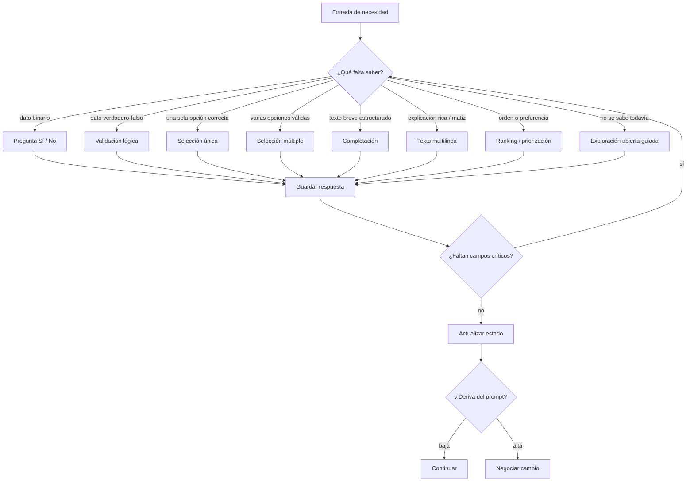

# 🧩 DIAGRAMA DE INFERENCIA DE TIPO DE PREGUNTA

> **Descripción:** Lógica de decisión para seleccionar el tipo de pregunta según el dato que falta obtener.  
> **Ubicación original:** `requerimientos.md` (líneas 1478-1550)  
> **Propósito:** Guía para el Motor de Preguntas (QI) al generar cuestionarios dinámicos.

---

## 📊 DIAGRAMA MERMAID



---

## 📋 REGLAS PRÁCTICAS POR TIPO DE PREGUNTA

### ✅ Sí/No o Verdadero/Falso

**Usar cuando:**
- Necesitas una validación rápida
- El dato es binario (sí/no, true/false)
- Quieres confirmar una hipótesis del sistema

**Ejemplos:**
- "¿Tienes un prototipo funcional?" → Sí/No
- "¿El objetivo es medible?" → Verdadero/Falso

---

### 🔘 Selección Única

**Usar cuando:**
- Solo una opción debe elegirse
- Quieres evitar ambigüedad
- El sistema necesita clasificar al usuario en un estado concreto

**Ejemplos:**
- "¿Cuál es tu situación actual?" → [Tengo prototipo | Solo idea | Ya vendo]
- "¿Qué cronotipo tienes?" → [Lark | Owl | Intermedio]

---

### ☑️ Selección Múltiple

**Usar cuando:**
- Varias respuestas pueden coexistir
- Quieres recoger contexto rico sin obligar a escribir
- El usuario puede tener más de un problema o recurso

**Ejemplos:**
- "¿Qué obstáculos has enfrentado?" → [Falta tiempo | Falta dinero | Falta conocimiento | Miedo]
- "¿Qué recursos tienes disponibles?" → [Computadora | Internet | Equipo | Capital]

---

### ✍️ Completación

**Usar cuando:**
- Conoces el marco de la respuesta
- Falta una palabra, frase o dato puntual
- Quieres que el usuario rellene un hueco preciso

**Ejemplos:**
- "Mi objetivo principal es: ______"
- "La fecha límite es: __/__/____"

---

### 📝 Texto Multilínea

**Usar cuando:**
- Necesitas relato, justificación o matiz
- Hay excepciones importantes
- El sistema aún no sabe qué categoría aplicar

**Ejemplos:**
- "Cuéntame más sobre tu situación actual..."
- "¿Qué te impide avanzar? Describe el obstáculo..."

---

### 🎯 Ranking / Priorización

**Usar cuando:**
- Necesitas conocer orden o preferencia
- Quieres jerarquizar elementos
- La importancia relativa es información crítica

**Ejemplos:**
- "Ordena estos objetivos por prioridad (1 = más importante)"
- "¿Qué aspecto quieres trabajar primero?"

---

### 💬 Exploración Abierta Guiada

**Usar cuando:**
- No se sabe todavía qué categoría aplicar
- El usuario está bloqueado
- Hay conflicto emocional o conceptual
- Necesitas explorar sin estructura rígida

**Ejemplos:**
- "¿Por dónde quieres comenzar?"
- "¿Qué es lo más importante para ti en este momento?"

---

## 🔄 FLUJO DE VALIDACIÓN POST-RESPUESTA

```
1. Guardar respuesta (K)
   ↓
2. ¿Faltan campos críticos? (L)
   ├─ SÍ → Volver a B (¿Qué falta saber?)
   └─ NO → Continuar
   ↓
3. Actualizar estado (M)
   ↓
4. ¿Deriva del prompt? (N)
   ├─ BAJA → Continuar (O)
   └─ ALTA → Negociar cambio (P)
```

---

## 🔗 RELACIÓN CON OTROS DIAGRAMAS

- **Diagrama 1:** `01-diagrama-maestro-sistema.md` - Contexto arquitectónico completo (Capa 4 - QBANK/RULES)
- **Diagrama 3:** `03-modelo-datos-ERD.md` - Esquema de preguntas y respuestas (entidades QUESTIONS/ANSWERS)

---

## 📌 IMPLEMENTACIÓN EN MÓDULOS

**Módulo responsable:** `modules/questionnaire-engine/` (Hito 1)

**Funciones relacionadas:**
- `generateQuestion()` - Decide tipo de pregunta según dato faltante
- `parseAnswer()` - Guarda respuesta (paso K del diagrama)
- `validateSchema()` - Verifica campos críticos (paso L)

---

**Última actualización:** 2026-03-19  
**Versión:** 1.0  
**Estado:** Estable (extraído de requerimientos.md)
