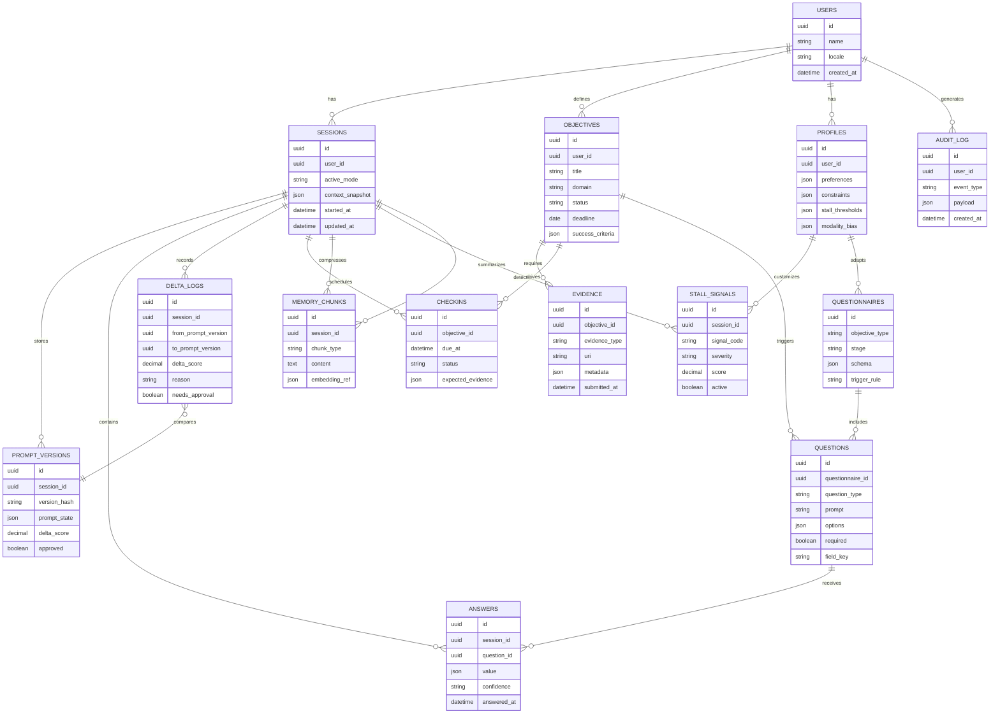

# 🗄️ DIAGRAMA DE MODELO DE DATOS (ERD)

> **Descripción:** Diagrama Entidad-Relación de las 13+ colecciones/tablas necesarias para el sistema.  
> **Ubicación original:** `requerimientos.md` (líneas 1550-1700)  
> **Propósito:** Esquema de base de datos para persistencia de sesiones, objetivos, preguntas, evidencias y más.

---

## 📊 DIAGRAMA MERMAID

---

## 📋 ENTIDADES DETALLADAS

### 👥 USERS (Usuarios)

| Campo | Tipo | Descripción |
|-------|------|-------------|
| `id` | uuid | Identificador único |
| `name` | string | Nombre del usuario |
| `locale` | string | Configuración regional |
| `created_at` | datetime | Fecha de creación |

**Relaciones:**
- Tiene múltiples SESSIONS
- Define múltiples OBJECTIVES
- Tiene un PROFILE
- Genera AUDIT_LOG entries

---

### 🎯 OBJECTIVES (Objetivos)

| Campo | Tipo | Descripción |
|-------|------|-------------|
| `id` | uuid | Identificador único |
| `user_id` | uuid | Referencia al usuario |
| `title` | string | Título del objetivo |
| `domain` | string | Dominio (cura, constructor, estudiante, etc.) |
| `status` | string | `pending | active | completed | abandoned` |
| `deadline` | date | Fecha límite |
| `success_criteria` | json | Criterios EMT (Evidencia-Métrica-Tiempo) |

**Relaciones:**
- Requiere EVIDENCE
- Drive CHECKINS
- Triggers QUESTIONS

---

### 👤 PROFILES (Perfiles de Usuario)

| Campo | Tipo | Descripción |
|-------|------|-------------|
| `id` | uuid | Identificador único |
| `user_id` | uuid | Referencia al usuario |
| `preferences` | json | Preferencias del usuario |
| `constraints` | json | Restricciones (tiempo, recursos) |
| `stall_thresholds` | json | Umbrales negociados de estancamiento |
| `modality_bias` | json | Sesgo de modalidad (chat vs cuestionario) |

**Relaciones:**
- Customiza STALL_SIGNALS
- Adapta QUESTIONNAIRES

---

### 📅 SESSIONS (Sesiones)

| Campo | Tipo | Descripción |
|-------|------|-------------|
| `id` | uuid | Identificador único |
| `user_id` | uuid | Referencia al usuario |
| `active_mode` | string | `chat | questionnaire | mixed` |
| `context_snapshot` | json | Instantánea del contexto actual |
| `started_at` | datetime | Inicio de sesión |
| `updated_at` | datetime | Última actualización |

**Relaciones:**
- Almacena PROMPT_VERSIONS
- Contiene ANSWERS
- Registra DELTA_LOGS
- Programa CHECKINS
- Comprime MEMORY_CHUNKS
- Detecta STALL_SIGNALS

---

### 📝 QUESTIONNAIRES (Cuestionarios)

| Campo | Tipo | Descripción |
|-------|------|-------------|
| `id` | uuid | Identificador único |
| `objective_type` | string | Tipo de objetivo al que aplica |
| `stage` | string | `entrada | ubicacion | modelado | conduccion | presion | cierre` |
| `schema` | json | Esquema de preguntas |
| `trigger_rule` | string | Regla de activación |

**Relaciones:**
- Incluye QUESTIONS

---

### ❓ QUESTIONS (Preguntas)

| Campo | Tipo | Descripción |
|-------|------|-------------|
| `id` | uuid | Identificador único |
| `questionnaire_id` | uuid | Referencia al cuestionario |
| `question_type` | string | `yesno | truefalse | single_choice | multi_choice | completion | multiline | ranking` |
| `prompt` | string | Texto de la pregunta |
| `options` | json | Opciones disponibles |
| `required` | boolean | Si es obligatoria |
| `field_key` | string | Clave para mapeo de respuesta |

**Relaciones:**
- Recibe ANSWERS

---

### 💬 ANSWERS (Respuestas)

| Campo | Tipo | Descripción |
|-------|------|-------------|
| `id` | uuid | Identificador único |
| `session_id` | uuid | Referencia a la sesión |
| `question_id` | uuid | Referencia a la pregunta |
| `value` | json | Valor de la respuesta |
| `confidence` | string | `low | medium | high` |
| `answered_at` | datetime | Fecha de respuesta |

---

### 📜 PROMPT_VERSIONS (Versiones de Prompt)

| Campo | Tipo | Descripción |
|-------|------|-------------|
| `id` | uuid | Identificador único |
| `session_id` | uuid | Referencia a la sesión |
| `version_hash` | string | Hash de la versión |
| `prompt_state` | json | Estado completo del prompt |
| `delta_score` | decimal | Score de deriva (0-1) |
| `approved` | boolean | Si fue aprobado |

**Relaciones:**
- Comparado por DELTA_LOGS

---

### 📈 DELTA_LOGS (Registro de Deriva)

| Campo | Tipo | Descripción |
|-------|------|-------------|
| `id` | uuid | Identificador único |
| `session_id` | uuid | Referencia a la sesión |
| `from_prompt_version` | uuid | Versión anterior |
| `to_prompt_version` | uuid | Versión nueva |
| `delta_score` | decimal | Score de deriva (0-1) |
| `reason` | string | Razón del cambio |
| `needs_approval` | boolean | Si requiere aprobación |

---

### 📁 EVIDENCE (Evidencias)

| Campo | Tipo | Descripción |
|-------|------|-------------|
| `id` | uuid | Identificador único |
| `objective_id` | uuid | Referencia al objetivo |
| `evidence_type` | string | `document | temporal_record | external_confirmation | self_report | physical_product` |
| `uri` | string | Ubicación (URL, path, etc.) |
| `metadata` | json | Metadatos de la evidencia |
| `submitted_at` | datetime | Fecha de envío |

---

### ⚠️ STALL_SIGNALS (Señales de Estancamiento)

| Campo | Tipo | Descripción |
|-------|------|-------------|
| `id` | uuid | Identificador único |
| `session_id` | uuid | Referencia a la sesión |
| `signal_code` | string | `S01 | S02 | ... | S12` |
| `severity` | string | `leve | grave | critico` |
| `score` | decimal | Score de la señal |
| `active` | boolean | Si está activa |

---

### ✅ CHECKINS (Puntos de Control)

| Campo | Tipo | Descripción |
|-------|------|-------------|
| `id` | uuid | Identificador único |
| `objective_id` | uuid | Referencia al objetivo |
| `due_at` | datetime | Fecha de vencimiento |
| `status` | string | `pending | completed | missed` |
| `expected_evidence` | json | Evidencia esperada |

---

### 🧠 MEMORY_CHUNKS (Fragmentos de Memoria)

| Campo | Tipo | Descripción |
|-------|------|-------------|
| `id` | uuid | Identificador único |
| `session_id` | uuid | Referencia a la sesión |
| `chunk_type` | string | `objective_summary | user_profile | key_insight | action_plan` |
| `content` | text | Contenido del fragmento |
| `embedding_ref` | json | Referencia al embedding (RAG) |

---

### 🔍 AUDIT_LOG (Registro de Auditoría)

| Campo | Tipo | Descripción |
|-------|------|-------------|
| `id` | uuid | Identificador único |
| `user_id` | uuid | Referencia al usuario |
| `event_type` | string | `prompt_change | stall_intervention | mode_switch | evidence_submitted` |
| `payload` | json | Datos del evento |
| `created_at` | datetime | Fecha del evento |

---

## 🔗 RELACIÓN CON OTROS DIAGRAMAS

- **Diagrama 1:** `01-diagrama-maestro-sistema.md` - Contexto arquitectónico (Capa 5 - Datos)
- **Diagrama 2:** `02-inferencia-tipo-pregunta.md` - Entidades QUESTIONS/ANSWERS

---

## 📌 IMPLEMENTACIÓN

**Tecnología recomendada:**
- **Desarrollo:** MongoDB (flexibilidad para JSON)
- **Producción:** PostgreSQL + JSONB (estructura + flexibilidad)
- **Cache:** Redis (sesiones activas, memoria temporal)

**Módulos relacionados:**
- `modules/session-manager/` - Gestiona SESSIONS
- `modules/objectives-manager/` - Gestiona OBJECTIVES (Hito 2)
- `modules/stall-detector/` - Gestiona STALL_SIGNALS (Hito 2)

---

**Última actualización:** 2026-03-19  
**Versión:** 1.0  
**Estado:** Estable (extraído de requerimientos.md)
