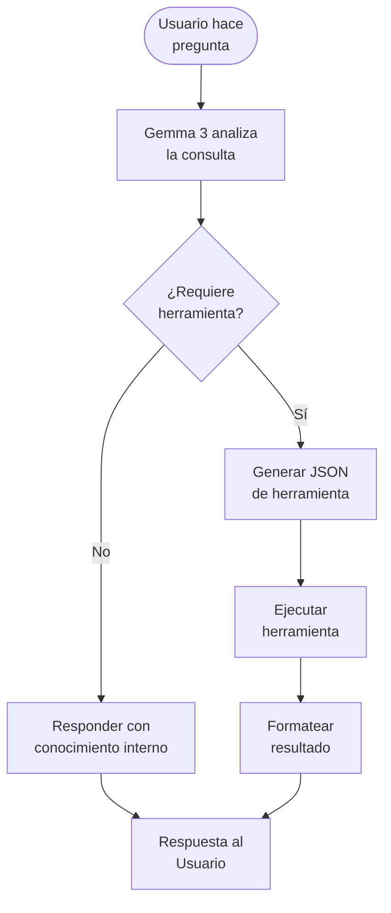

# 📘 Guía Profesional de Gemma + Ollama para ARES

> Documentación completa para uso eficaz y eficiente de Google Gemma 3 con Ollama en ARES.

---

## 📋 Índice

1. [Introducción](#introducción)
2. [Configuración](#configuración)
3. [Sistema de Plantillas YAML](#sistema-de-plantillas-yaml)
4. [Function Calling con Herramientas](#function-calling-con-herramientas)
5. [Modelos Disponibles](#modelos-disponibles)
6. [Parámetros de Generación](#parámetros-de-generación)
7. [Tips y Mejores Prácticas](#tips-y-mejores-prácticas)
8. [Referencias a Frameworks](#referencias-a-frameworks)

---

## 🚀 Introducción

### ¿Qué es Gemma 3?

**Gemma 3** es la tercera generación de modelos de lenguaje abiertos de Google, optimizados para:
- ✅ Ejecución local eficiente
- ✅ Function calling estructurado
- ✅ Multimodalidad (texto + imágenes en versiones específicas)
- ✅ Bajo consumo de recursos

### ¿Por qué Ollama?

**Ollama** es el runtime que permite ejecutar Gemma localmente con:
- 📦 Gestión automática de modelos
- 🔌 API REST simple
- ⚡ Optimización para CPU/GPU
- 🛡️ Privacidad total (todo local)

### Arquitectura en ARES

```
┌─────────────────────────────────────────────────────────────┐
│                        ARES (TR)                            │
│  ┌───────────────────────────────────────────────────────┐  │
│  │                    AIEngine                           │  │
│  │  (Dispatcher Multi-Provider)                          │  │
│  └───────────────────────────────────────────────────────┘  │
│           │                    │                    │        │
│           ▼                    ▼                    ▼        │
│  ┌────────────────┐  ┌────────────────┐  ┌────────────────┐ │
│  │  GemmaProvider │  │ DeepSeekProvider│ │ OpenRouterProv │ │
│  │   (Ollama)     │  │    (API)       │  │   (Placeholder)│ │
│  └────────────────┘  └────────────────┘  └────────────────┘ │
│           │                                                   │
│           ▼                                                   │
│  ┌─────────────────────────────────────────────────────────┐ │
│  │              TemplateManager + ToolRegistry             │ │
│  └─────────────────────────────────────────────────────────┘ │
└─────────────────────────────────────────────────────────────┘
```

---

## ⚙️ Configuración

### 1. Instalar Ollama

```bash
# Linux
curl -fsSL https://ollama.com/install.sh | sh

# Verificar instalación
ollama --version
```

### 2. Descargar Modelos Gemma

```bash
# Gemma 3 4B (recomendado para uso general)
ollama pull gemma3:4b

# Gemma 3 12B (casos complejos, requiere más RAM)
ollama pull gemma3:12b

# Gemma 3 1B (recursos limitados)
ollama pull gemma3:1b

# Listar modelos instalados
ollama list
```

### 3. Configurar en ARES

Editar `config/config.yaml`:

```yaml
ai:
  default_provider: "gemma"
  
  gemma:
    base_url: "http://localhost:11434"
    model: "gemma3:4b"
```

### 4. Verificar Conexión

```bash
# Desde ARES
tr status

# Test directo a Ollama
curl http://localhost:11434/api/tags
```

---

## 📄 Sistema de Plantillas YAML

### Estructura de Plantilla

```yaml
# modules/ia/templates/gemma/<nombre>.yaml

content: |
  <start_of_turn>user
  {prompt}<end_of_turn>
  <start_of_turn>model

config:
  model: "gemma3:4b"
  temperature: 0.7
  top_p: 0.95
  max_tokens: 2048
  description: "Descripción de la plantilla"
```

### Plantillas Incluidas

| Plantilla | Uso | Modelo | Temperatura |
|-----------|-----|--------|-------------|
| `default` | Consultas generales | gemma3:4b | 0.7 |
| `chat` | Conversaciones | gemma3:4b | 0.7 |
| `code` | Programación | gemma3:12b | 0.3 |
| `tools` | Function calling | gemma3:4b | 0.2 |

### Uso desde CLI

```bash
# Usar plantilla específica
ares p "Explica este código" --template code

# Combinar con modelo
ares p "¿Qué es Python?" --model gemma12b --template chat

# Listar plantillas disponibles
ares templates
```

### Crear Plantilla Personalizada

1. Crear archivo en `modules/ia/templates/gemma/mi_plantilla.yaml`:

```yaml
content: |
  <start_of_turn>system
  Eres un experto en {tema}. Responde de forma técnica pero clara.
  <end_of_turn>
  <start_of_turn>user
  {prompt}<end_of_turn>
  <start_of_turn>model

config:
  model: "gemma3:4b"
  temperature: 0.5
  description: "Plantilla para respuestas técnicas"
```

2. Usar:

```bash
tr p "¿Qué es un transformer?" --template mi_plantilla
```

---

## 🛠️ Function Calling con Herramientas

### ¿Qué es Function Calling?

El **function calling** permite que el LLM estructure su salida para invocar funciones externas de manera segura y controlada.

### Flujo del Sistema



### Herramientas Disponibles

| Herramienta | Descripción | Parámetros |
|-------------|-------------|------------|
| `google_search` | Búsqueda en tiempo real | `query` |
| `translate_text` | Traducción de texto | `text`, `target_language` |
| `get_weather` | Clima actual | `city` |
| `execute_shell` | Ejecutar comando | `command`, `working_dir` |
| `read_file` | Leer archivo | `path`, `max_lines` |
| `write_file` | Escribir archivo | `path`, `content`, `append` |

### Formato de Llamada

```json
{
  "name": "google_search",
  "parameters": {
    "query": "AWS re:Invent 2025 fechas"
  }
}
```

### Ejemplo de Uso

```bash
# Consulta que activa búsqueda
ares p "¿Quién ganó el Mundial 2022?" --template tools

# Consulta que activa clima
ares p "¿Qué temperatura hay en Madrid?" --template tools

# Consulta que activa traducción
ares p "Traduce 'Hello World' al francés" --template tools
```

### Registrar Nueva Herramienta

```python
from modules.ia.tools import ToolRegistry

registry = ToolRegistry()

def mi_herramienta(param1: str) -> str:
    """Descripción de la herramienta."""
    return f"Resultado: {param1}"

registry.register(
    name="mi_herramienta",
    description="Descripción para el LLM",
    parameters={
        "type": "object",
        "properties": {
            "param1": {"type": "string", "description": "Parámetro 1"}
        },
        "required": ["param1"]
    },
    executor=mi_herramienta
)
```

---

## 📊 Modelos Disponibles

### Gemma 3 Family

| Modelo | Parámetros | RAM Mínima | Uso Recomendado |
|--------|------------|------------|-----------------|
| `gemma3:1b` | 1B | 2 GB | Dispositivos limitados, respuestas rápidas |
| `gemma3:4b` | 4B | 8 GB | **Uso general (default)** |
| `gemma3:12b` | 12B | 16 GB | Código complejo, razonamiento |
| `gemma3:27b` | 27B | 32 GB | Máxima precisión (GPU recomendada) |

### Selección de Modelo

```bash
# Por alias configurado
ares p "pregunta" --model gemma      # gemma3:4b
ares p "pregunta" --model gemma12b   # gemma3:12b
ares p "pregunta" --model deepseek   # DeepSeek API

# Ver modelos disponibles
ares models
```

---

## 🎚️ Parámetros de Generación

### Parámetros Principales

| Parámetro | Rango | Default | Efecto |
|-----------|-------|---------|--------|
| `temperature` | 0-2 | 0.7 | Creatividad (alto) vs Determinismo (bajo) |
| `top_p` | 0-1 | 0.95 | Muestreo por núcleo |
| `top_k` | 1-100 | 40 | Muestreo de tokens superiores |
| `max_tokens` | 1-8192 | 2048 | Longitud máxima de respuesta |
| `repeat_penalty` | 0-2 | 1.1 | Penalización por repetición |

### Ejemplos de Configuración

```yaml
# Creativo (storytelling, brainstorming)
temperature: 0.9
top_p: 0.95
top_k: 50

# Código (preciso, determinista)
temperature: 0.2
top_p: 0.9
top_k: 40
repeat_penalty: 1.05

# Chat balanceado
temperature: 0.7
top_p: 0.9
top_k: 40
```

### Uso desde CLI

```bash
ares p "Escribe un poema" --temperature 0.9
ares p "Depura este código" --temperature 0.2 --template code
```

---

## 💡 Tips y Mejores Prácticas

### 1. Prompt Engineering para Gemma 3

✅ **Hacer:**
```
- Sé específico y directo
- Incluye contexto relevante
- Usa ejemplos few-shot cuando sea necesario
- Especifica formato de salida deseado
```

❌ **Evitar:**
```
- Prompts ambiguos o muy largos
- Múltiples preguntas en uno
- Instrucciones contradictorias
```

### 2. Optimización de Recursos

```bash
# Mantener modelo cargado (evita latencia)
ollama run gemma3:4b ""

# Descargar modelo después de usar
curl http://localhost:11434/api/generate -d '{"model": "gemma3:4b", "keep_alive": 0}'

# Usar gemma3:1b para tareas simples
ares p "suma 2+2" --model gemma
```

### 3. Function Calling Efectivo

- **Instrucciones claras en system prompt**
- **JSON estricto sin markdown**
- **Validar parámetros antes de ejecutar**
- **Manejar errores gracefulmente**

### 4. Sistema de Plantillas

```
modules/ia/templates/gemma/
├── default.yaml      # Uso general
├── chat.yaml         # Conversacional
├── code.yaml         # Programación
├── tools.yaml        # Herramientas
├── creative.yaml     # Creativo (por crear)
└── technical.yaml    # Técnico (por crear)
```

---

## 🔗 Referencias a Frameworks

### LangChain + Ollama

```python
from langchain_community.llms import Ollama

llm = Ollama(
    model="gemma3:4b",
    base_url="http://localhost:11434",
    temperature=0.7
)

response = llm.invoke("¿Qué es Python?")
```

### LlamaIndex + Gemma

```python
from llama_index.llms.ollama import Ollama

llm = Ollama(
    model="gemma3:4b",
    request_timeout=120.0,
)
```

### Ollama Python SDK

```python
import ollama

response = ollama.chat(
    model="gemma3:4b",
    messages=[{"role": "user", "content": "Hola"}]
)
print(response["message"]["content"])
```

### Hugging Face Transformers

Para uso sin Ollama (requiere GPU):

```python
from transformers import AutoModelForCausalLM, AutoTokenizer

model = AutoModelForCausalLM.from_pretrained("google/gemma-3-4b-it")
tokenizer = AutoTokenizer.from_pretrained("google/gemma-3-4b-it")
```

---

## 📎 Apéndices

### A. Comandos Útiles de Ollama

```bash
# Listar modelos
ollama list

# Eliminar modelo
ollama rm gemma3:4b

# Ver información de modelo
ollama show gemma3:4b

# Crear modelo personalizado
ollama create mi-gemma -f Modelfile

# Servidor Ollama con logs
OLLAMA_DEBUG=1 ollama serve
```

### B. Solución de Problemas

| Problema | Solución |
|----------|----------|
| "Connection refused" | Verificar `ollama serve` está corriendo |
| "Model not found" | Ejecutar `ollama pull gemma3:4b` |
| Respuestas lentas | Usar `gemma3:1b` o reducir `max_tokens` |
| Out of memory | Cerrar otros modelos: `keep_alive: 0` |

### C. Recursos Oficiales

- [Ollama Documentation](https://ollama.com/api)
- [Gemma Google AI](https://ai.google.dev/gemma)
- [Gemma Hugging Face](https://huggingface.co/google/gemma-3-4b-it)

---

*Documentación creada para ARES - Terminal Remote Operations Nexus*
