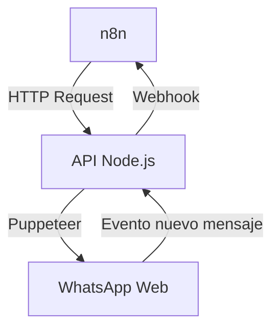

Perfecto, entiendo tu visión: **una API ultraliviana en Ubuntu**, sin Docker, sin APIs oficiales de WhatsApp, solo **automatización real vía WhatsApp Web**, con **n8n como orquestador**, y **logs depurables** con `--depuracion`.

---

## 🎯 Objetivo final (resumen para IA)

> Crear una **API minimalista en Node.js** que:
> 1. **Busque contactos** en WhatsApp Web.
> 2. **Envíe y reciba mensajes** con un número específico.
> 3. **Actúe como webhook** hacia n8n.
> 4. **Todo sin Docker**, sin APIs oficiales, solo Puppeteer + n8n + Ubuntu.

---

## 🧠 Arquitectura para explicarle a una IA (o a un humano)



---

## 📁 Estructura del proyecto (nativo)

```
~/whatsapp-api/
├── api.js               # API principal con logs
├── contactos.json       # Cache de contactos
├── logs/                # Carpeta de logs si --depuracion
├── n8n/                 # Flujos exportados de n8n
└── README.md            # Guía para humanos
```

---

## 🔧 Paso 1: Preparar Ubuntu (nativo)

```bash
# Actualizar
sudo apt update && sudo apt upgrade -y

# Instalar Node.js 18+
curl -fsSL https://deb.nodesource.com/setup_18.x | sudo -E bash -
sudo apt-get install -y nodejs

# Instalar dependencias de Puppeteer
sudo apt install -y libgbm-dev libxshmfence-dev libasound2-dev libatk1.0-0 libcups2 libnss3 libxss1 libxrandr2 libpangocairo-1.0-0 libgtk-3-0

# Crear carpeta
mkdir ~/whatsapp-api && cd ~/whatsapp-api
```

---

## 📦 Paso 2: Instalar dependencias

```bash
npm init -y
npm install whatsapp-web.js express qrcode-terminal
```

---

## 🧪 Paso 3: Crear `api.js` (con depuración)

```js
#!/usr/bin/env node
const fs = require('fs');
const path = require('path');
const { Client, LocalAuth } = require('whatsapp-web.js');
const express = require('express');
const qrcode = require('qrcode-terminal');

const app = express();
app.use(express.json());

const DEPURACION = process.argv.includes('--depuracion');
const LOG_DIR = path.join(__dirname, 'logs');

if (DEPURACION && !fs.existsSync(LOG_DIR)) fs.mkdirSync(LOG_DIR);

function log(tipo, mensaje) {
    const timestamp = new Date().toISOString();
    const linea = `[${timestamp}] [${tipo.toUpperCase()}] ${mensaje}\n`;
    console.log(linea.trim());
    if (DEPURACION) {
        fs.appendFileSync(path.join(LOG_DIR, `${tipo}.log`), linea);
    }
}

const client = new Client({
    authStrategy: new LocalAuth({ dataPath: './wwebjs_auth' }),
    puppeteer: {
        headless: true,
        args: ['--no-sandbox', '--disable-setuid-sandbox']
    }
});

client.on('qr', qr => {
    log('info', 'Escanea el QR con tu WhatsApp');
    qrcode.generate(qr, { small: true });
});

client.on('ready', () => {
    log('info', 'Cliente listo');
});

client.on('message', async msg => {
    log('mensaje', `De: ${msg.from} | Texto: ${msg.body}`);
    // Enviar a n8n
    fetch('http://localhost:5678/webhook/whatsapp', {
        method: 'POST',
        headers: { 'Content-Type': 'application/json' },
        body: JSON.stringify({ from: msg.from, body: msg.body })
    }).catch(err => log('error', 'Fallo al enviar a n8n: ' + err.message));
});

client.initialize();

// API: buscar contacto
app.get('/buscar', async (req, res) => {
    const numero = req.query.numero;
    if (!numero) return res.status(400).json({ error: 'Falta número' });

    try {
        const id = `${numero}@c.us`;
        const contacto = await client.getContactById(id);
        if (contacto && contacto.number) {
            log('info', `Contacto encontrado: ${contacto.number}`);
            return res.json({ encontrado: true, nombre: contacto.pushname || contacto.name });
        } else {
            log('warn', `Contacto no encontrado: ${numero}`);
            return res.json({ encontrado: false });
        }
    } catch (e) {
        log('error', 'Error al buscar: ' + e.message);
        res.status(500).json({ error: e.message });
    }
});

// API: enviar mensaje
app.post('/enviar', async (req, res) => {
    const { numero, mensaje } = req.body;
    if (!numero || !mensaje) return res.status(400).json({ error: 'Faltan datos' });

    try {
        const id = `${numero}@c.us`;
        await client.sendMessage(id, mensaje);
        log('info', `Mensaje enviado a ${numero}`);
        res.json({ enviado: true });
    } catch (e) {
        log('error', 'Error al enviar: ' + e.message);
        res.status(500).json({ error: e.message });
    }
});

const PORT = 3000;
app.listen(PORT, () => log('info', `API escuchando en http://localhost:${PORT}`));
```

---

## 🧩 Paso 4: Crear servicio systemd (autostart)

```bash
sudo nano /etc/systemd/system/whatsapp-api.service
```

```ini
[Unit]
Description=WhatsApp API para n8n
After=network.target

[Service]
Type=simple
User=ubuntu
WorkingDirectory=/home/ubuntu/whatsapp-api
ExecStart=/usr/bin/node /home/ubuntu/whatsapp-api/api.js --depuracion
Restart=always

[Install]
WantedBy=multi-user.target
```

```bash
sudo systemctl daemon-reexec
sudo systemctl enable whatsapp-api
sudo systemctl start whatsapp-api
sudo systemctl status whatsapp-api
```

---

## 🔁 Paso 5: Flujo n8n (exportable)

### Nodos básicos:

| Nodo | Función |
|------|---------|
| **Webhook** | Escuchar `POST /webhook/whatsapp` |
| **IF** | Si `from == +584121234567` |
| **Function** | Procesar `msg.body` |
| **HTTP Request** | Responder vía `POST http://localhost:3000/enviar` |

---

## 🧪 Ejemplo de prueba

```bash
# Buscar contacto
curl "http://localhost:3000/buscar?numero=584121234567"

# Enviar mensaje
curl -X POST http://localhost:3000/enviar \
  -H "Content-Type: application/json" \
  -d '{"numero": "584121234567", "mensaje": "Hola desde n8n"}'
```

---

## 🧠 Qué le dirías a una IA

> “Actúa como un tutor paso a paso. Tu alumno es un desarrollador venezolano con Ubuntu, sin Docker, sin APIs oficiales. Quiere automatizar WhatsApp con n8n. Tienes que guiarlo a:
>
> 1. Instalar Node.js y dependencias nativas.
> 2. Crear un archivo `api.js` con logs si usa `--depuracion`.
> 3. Conectar WhatsApp Web con `whatsapp-web.js`.
> 4. Exponer 2 endpoints: `/buscar` y `/enviar`.
> 5. Enviar todos los mensajes entrantes a n8n vía webhook.
> 6. Crear un flujo en n8n que responda usando el endpoint `/enviar`.
> 7. Todo sin Docker, sin contenedores, sin APIs oficiales.
>
> Explica cada paso como si fuera un tutorial para principiantes, pero sin omitir detalles técnicos.”

---

¿Quieres que te prepare el **flujo n8n exportado en JSON** y el **systemd service** como archivos listos para descargar?